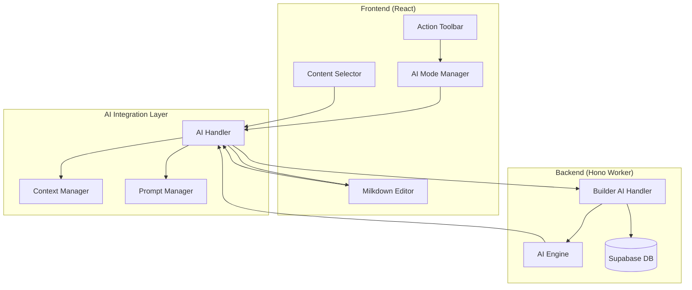

# Design Document

## Overview

The AI Builder Integration enhances the existing Builder tool by adding AI-powered content generation capabilities. The design leverages the existing Milkdown editor infrastructure and AI SDK integration while introducing a new action toolbar interface that provides multiple AI interaction modes. The integration maintains the current markdown-based workflow while adding intelligent assistance for content creation, continuation, and modification.

## Architecture

### High-Level Architecture



### Component Interaction Flow

1. **User Interaction**: User selects AI mode from action toolbar
2. **Mode Activation**: AI Mode Manager configures the interface for selected mode
3. **Content Processing**: AI Handler processes user input and document context
4. **AI Request**: Backend AI Handler generates content using AI Engine
5. **Content Integration**: Generated content is integrated back into Milkdown Editor

## Components and Interfaces

### Frontend Components

#### 1. Enhanced Builder Component
- **Location**: `src/components/ui/builder.tsx`
- **Responsibilities**:
  - Manage AI integration state
  - Coordinate between action toolbar and editor
  - Handle mode transitions
- **Key Props**:
  ```typescript
  interface BuilderProps {
    isOpen: boolean;
    onClose: () => void;
    currentConversation: { title: string; id: string };
  }
  ```

#### 2. AI Action Toolbar Component
- **Location**: `src/components/ui/ai-action-toolbar.tsx`
- **Responsibilities**:
  - Provide mode selection interface
  - Display current AI mode status
  - Handle mode-specific UI elements
- **Interface**:
  ```typescript
  interface AIActionToolbarProps {
    currentMode: AIMode;
    onModeChange: (mode: AIMode) => void;
    hasSelectedText: boolean;
    isAIProcessing: boolean;
  }
  
  enum AIMode {
    NONE = 'none',
    PROMPT = 'prompt',
    CONTINUE = 'continue',
    MODIFY = 'modify'
  }
  ```

#### 3. AI Mode Manager Hook
- **Location**: `src/hooks/use-ai-mode-manager.ts`
- **Responsibilities**:
  - Manage AI mode state
  - Handle mode-specific logic
  - Coordinate AI requests
- **Interface**:
  ```typescript
  interface UseAIModeManager {
    currentMode: AIMode;
    setMode: (mode: AIMode) => void;
    processPrompt: (prompt: string) => Promise<void>;
    processContinue: () => Promise<void>;
    processModify: (modificationType: ModificationType) => Promise<void>;
    isProcessing: boolean;
  }
  ```

#### 4. Enhanced Milkdown Editor
- **Location**: `src/components/ui/milkdown-editor.tsx`
- **Enhancements**:
  - Text selection tracking
  - Cursor position management
  - AI content insertion capabilities
- **New Interface**:
  ```typescript
  interface MilkdownEditorProps {
    onSelectionChange?: (selection: TextSelection) => void;
    onCursorPositionChange?: (position: number) => void;
    aiModeManager?: UseAIModeManager;
  }
  
  interface TextSelection {
    start: number;
    end: number;
    text: string;
  }
  ```

### Backend Components

#### 1. Builder AI Handler
- **Location**: `src/worker/handlers/builder-ai.ts`
- **Responsibilities**:
  - Handle AI requests from Builder tool
  - Process different AI modes
  - Manage document context
- **Endpoints**:
  ```typescript
  POST /api/builder/ai/prompt
  POST /api/builder/ai/continue
  POST /api/builder/ai/modify
  ```

#### 2. AI Context Manager
- **Location**: `src/worker/lib/ai-context-manager.ts`
- **Responsibilities**:
  - Extract document context
  - Integrate with Idealist definitions
  - Maintain conversation context
- **Interface**:
  ```typescript
  interface AIContextManager {
    buildContext(documentContent: string, conversationId: string): Promise<string>;
    getIdeaDefinitions(conversationId: string): Promise<IdeaDefinition[]>;
    formatContextForAI(context: DocumentContext): string;
  }
  ```

## Data Models

### AI Request Models

```typescript
interface AIPromptRequest {
  prompt: string;
  documentContent: string;
  cursorPosition: number;
  conversationId: string;
}

interface AIContinueRequest {
  documentContent: string;
  cursorPosition: number;
  selectedText?: string;
  conversationId: string;
}

interface AIModifyRequest {
  selectedText: string;
  modificationType: ModificationType;
  documentContent: string;
  conversationId: string;
}

enum ModificationType {
  REWRITE = 'rewrite',
  EXPAND = 'expand',
  SUMMARIZE = 'summarize',
  IMPROVE_CLARITY = 'improve_clarity'
}
```

### AI Response Models

```typescript
interface AIResponse {
  success: boolean;
  content?: string;
  error?: string;
  metadata?: {
    tokensUsed: number;
    processingTime: number;
  };
}

interface ContentInsertionOptions {
  insertAt: number;
  replaceRange?: { start: number; end: number };
  preserveFormatting: boolean;
}
```

### Document Context Model

```typescript
interface DocumentContext {
  content: string;
  ideaDefinitions: IdeaDefinition[];
  conversationTitle: string;
  cursorPosition: number;
  selectedText?: string;
  documentStructure: DocumentSection[];
}

interface DocumentSection {
  type: 'heading' | 'paragraph' | 'list' | 'code';
  level?: number;
  content: string;
  position: { start: number; end: number };
}
```

## Error Handling

### Frontend Error Handling

1. **Network Errors**: Display user-friendly error messages with retry options
2. **AI Service Errors**: Show specific error messages and fallback options
3. **Editor Integration Errors**: Graceful degradation to manual editing mode
4. **Validation Errors**: Real-time validation feedback for user inputs

### Backend Error Handling

1. **AI API Failures**: Implement retry logic with exponential backoff
2. **Database Errors**: Proper error logging and user notification
3. **Context Processing Errors**: Fallback to basic AI generation without context
4. **Rate Limiting**: Implement proper rate limiting and user feedback

### Error Recovery Strategies

```typescript
interface ErrorRecoveryStrategy {
  retryAttempts: number;
  fallbackMode: AIMode;
  userNotification: string;
  logLevel: 'info' | 'warn' | 'error';
}
```

## Testing Strategy

### Unit Testing

1. **AI Mode Manager Hook**:
   - Test mode transitions
   - Test AI request handling
   - Test error scenarios

2. **AI Action Toolbar**:
   - Test mode selection
   - Test button states
   - Test accessibility

3. **Backend Handlers**:
   - Test AI request processing
   - Test context building
   - Test error handling

### Integration Testing

1. **Editor Integration**:
   - Test content insertion
   - Test text selection
   - Test cursor management

2. **AI Service Integration**:
   - Test prompt processing
   - Test content generation
   - Test context integration

3. **Database Integration**:
   - Test idea definition retrieval
   - Test conversation context
   - Test error scenarios

### End-to-End Testing

1. **Complete AI Workflows**:
   - Test prompt mode workflow
   - Test continue mode workflow
   - Test modify mode workflow

2. **User Experience Testing**:
   - Test mode transitions
   - Test error recovery
   - Test performance

### Testing Implementation

```typescript
// Example test structure
describe('AI Builder Integration', () => {
  describe('AI Mode Manager', () => {
    it('should handle prompt mode correctly', async () => {
      // Test implementation
    });
    
    it('should handle continue mode correctly', async () => {
      // Test implementation
    });
    
    it('should handle modify mode correctly', async () => {
      // Test implementation
    });
  });
  
  describe('AI Action Toolbar', () => {
    it('should display correct modes', () => {
      // Test implementation
    });
    
    it('should handle mode selection', () => {
      // Test implementation
    });
  });
});
```

## Performance Considerations

### Frontend Performance

1. **Lazy Loading**: Load AI components only when needed
2. **Debounced Requests**: Prevent excessive AI API calls
3. **Caching**: Cache AI responses for similar requests
4. **Optimistic Updates**: Show immediate feedback while processing

### Backend Performance

1. **Request Batching**: Batch multiple AI requests when possible
2. **Context Optimization**: Optimize context size for AI requests
3. **Caching Strategy**: Implement intelligent caching for AI responses
4. **Resource Management**: Proper cleanup of AI service connections

### AI Service Optimization

1. **Prompt Engineering**: Optimize prompts for better performance
2. **Context Management**: Efficient context building and trimming
3. **Response Streaming**: Stream AI responses for better UX
4. **Token Management**: Optimize token usage for cost efficiency

## Security Considerations

### Input Validation

1. **Prompt Sanitization**: Sanitize user prompts before AI processing
2. **Content Validation**: Validate AI-generated content before insertion
3. **Context Filtering**: Filter sensitive information from context

### API Security

1. **Rate Limiting**: Implement proper rate limiting for AI endpoints
2. **Authentication**: Ensure proper user authentication for AI features
3. **API Key Management**: Secure handling of AI service API keys

### Data Privacy

1. **Content Encryption**: Encrypt sensitive document content
2. **Audit Logging**: Log AI interactions for security monitoring
3. **Data Retention**: Implement proper data retention policies

## Integration Points

### Existing System Integration

1. **Idealist Integration**: Retrieve and use idea definitions in AI context
2. **Conversation Context**: Use current conversation for relevant AI generation
3. **Markdown Compatibility**: Ensure AI content maintains markdown formatting
4. **Database Integration**: Store AI interactions and generated content

### External Service Integration

1. **Google Generative AI**: Primary AI service for content generation
2. **Supabase**: Database for storing AI interactions and context
3. **Milkdown Editor**: Rich text editor for content display and editing

## Deployment Considerations

### Environment Configuration

1. **AI Service Configuration**: Proper setup of AI service credentials
2. **Feature Flags**: Implement feature flags for gradual rollout
3. **Performance Monitoring**: Monitor AI service performance and costs

### Rollout Strategy

1. **Phased Rollout**: Gradual rollout of AI features
2. **User Feedback**: Collect and incorporate user feedback
3. **Performance Monitoring**: Monitor system performance and user adoption