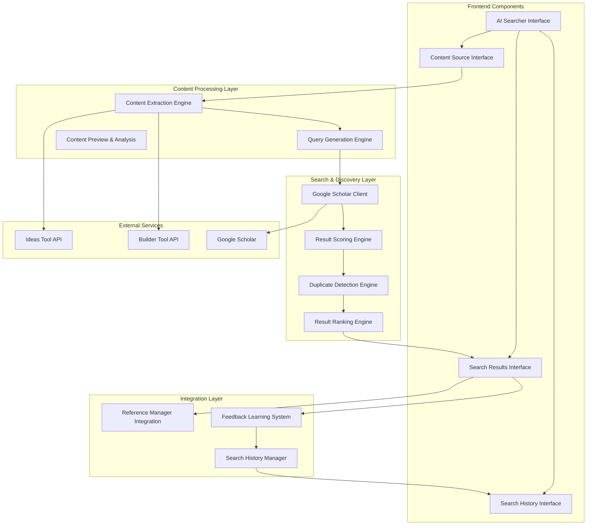

# Design Document

## Overview

The AI-Powered Reference Searcher is a comprehensive enhancement to the existing Referencer Tool that provides intelligent academic reference discovery. It integrates content extraction from Ideas and Builder tools with Google Scholar search capabilities to automatically suggest relevant academic sources. The system uses AI-powered content analysis, intelligent query generation, and relevance scoring to provide high-quality reference suggestions.

## Architecture

### High-Level Architecture



## Components and Interfaces

### Frontend Components

#### 1. AI Searcher Interface
- **Location**: `src/components/ui/ai-searcher.tsx` (enhanced)
- **Responsibilities**:
  - Main interface for AI-powered search
  - Content source selection
  - Search query management
  - Results display and interaction
- **Interface**:
  ```typescript
  interface AISearcherProps {
    conversationId: string;
    onAddReference: (reference: Partial<Reference>) => void;
    onSearchHistory?: () => void;
  }
  
  interface AISearcherState {
    selectedSources: ContentSource[];
    extractedContent: ExtractedContent[];
    searchQuery: string;
    searchResults: SearchResult[];
    isSearching: boolean;
    searchHistory: SearchHistoryItem[];
    filters: SearchFilters;
  }
  ```

#### 2. Content Source Interface
- **Location**: `src/components/ui/content-source-selector.tsx`
- **Responsibilities**:
  - Select Ideas or Builder content
  - Preview extracted content
  - Content filtering and refinement
- **Interface**:
  ```typescript
  interface ContentSourceSelectorProps {
    conversationId: string;
    onContentSelected: (content: ExtractedContent[]) => void;
    onContentPreview: (content: ExtractedContent) => void;
  }
  ```

#### 3. Search Results Interface
- **Location**: `src/components/ui/search-results-display.tsx`
- **Responsibilities**:
  - Display ranked search results
  - Show confidence and relevance scores
  - Handle result actions (add, feedback)
- **Interface**:
  ```typescript
  interface SearchResultsDisplayProps {
    results: SearchResult[];
    onAddReference: (result: SearchResult) => void;
    onProvideFeedback: (resultId: string, feedback: Feedback) => void;
    onResultAction: (action: ResultAction) => void;
  }
  ```

### Backend Components

#### 1. Google Scholar Client
- **Location**: `src/worker/lib/google-scholar-client.ts`
- **Responsibilities**:
  - Execute Google Scholar searches
  - Parse search result HTML
  - Handle rate limiting and errors
- **Interface**:
  ```typescript
  interface GoogleScholarClient {
    search(query: string, options?: SearchOptions): Promise<ScholarSearchResult[]>;
    parseResults(html: string): ScholarSearchResult[];
    handleRateLimit(): Promise<void>;
    validateResults(results: ScholarSearchResult[]): ScholarSearchResult[];
  }
  ```

#### 2. Query Generation Engine
- **Location**: `src/worker/lib/query-generation-engine.ts`
- **Responsibilities**:
  - Generate search queries from extracted content
  - Optimize queries for academic search
  - Handle multiple content sources
- **Interface**:
  ```typescript
  interface QueryGenerationEngine {
    generateQueries(content: ExtractedContent[]): SearchQuery[];
    optimizeQuery(query: string): string;
    combineQueries(queries: SearchQuery[]): SearchQuery;
    validateQuery(query: string): ValidationResult;
  }
  ```

#### 3. Result Scoring Engine
- **Location**: `src/worker/lib/result-scoring-engine.ts`
- **Responsibilities**:
  - Score search results for relevance
  - Calculate confidence metrics
  - Rank results by quality
- **Interface**:
  ```typescript
  interface ResultScoringEngine {
    scoreRelevance(result: ScholarSearchResult, content: ExtractedContent): number;
    calculateConfidence(result: ScholarSearchResult): number;
    rankResults(results: ScholarSearchResult[]): RankedResult[];
    applyQualityMetrics(results: ScholarSearchResult[]): QualityScore[];
  }
  ```

## Data Models

### Search Models

```typescript
interface SearchQuery {
  id: string;
  query: string;
  originalContent: ExtractedContent[];
  generatedAt: Date;
  confidence: number;
  keywords: string[];
  topics: string[];
}

interface SearchResult extends ScholarSearchResult {
  relevanceScore: number;
  confidenceScore: number;
  qualityScore: number;
  addedToLibrary: boolean;
  userFeedback?: Feedback;
  searchQueryId: string;
}

interface SearchFilters {
  dateRange?: {
    start: number;
    end: number;
  };
  authors?: string[];
  journals?: string[];
  minCitations?: number;
  maxResults?: number;
  sortBy: 'relevance' | 'date' | 'citations' | 'quality';
}

interface Feedback {
  resultId: string;
  userId: string;
  isRelevant: boolean;
  qualityRating: number; // 1-5 scale
  comments?: string;
  timestamp: Date;
}
```

### Content Models

```typescript
interface ContentSource {
  type: 'ideas' | 'builder';
  id: string;
  title: string;
  preview: string;
  selected: boolean;
}

interface ExtractedContent {
  sourceId: string;
  sourceType: 'ideas' | 'builder';
  title: string;
  content: string;
  keywords: string[];
  keyPhrases: string[];
  topics: string[];
  confidence: number;
  extractedAt: Date;
}
```

### Analytics Models

```typescript
interface SearchAnalytics {
  totalSearches: number;
  successfulSearches: number;
  averageResultsPerSearch: number;
  topSearchTopics: string[];
  mostUsedSources: ('ideas' | 'builder')[];
  averageRelevanceScore: number;
  userSatisfactionScore: number;
  searchTrends: SearchTrend[];
}

interface SearchTrend {
  period: string;
  searchCount: number;
  successRate: number;
  topTopics: string[];
}
```

## Integration Points

### Existing System Integration

1. **Referencer Tool Integration**: Seamless integration with existing reference management
2. **Ideas Tool Integration**: Extract content from user's ideas and research notes
3. **Builder Tool Integration**: Extract content from thesis/document builder
4. **Database Integration**: Store search history and analytics in existing database

### External Service Integration

1. **Google Scholar**: Web scraping for academic paper search
2. **DOI Resolution**: Enhanced metadata extraction for found papers
3. **Citation Databases**: Cross-reference with other academic databases

## Performance Considerations

### Search Performance

1. **Query Optimization**: Intelligent query generation to reduce unnecessary searches
2. **Result Caching**: Cache search results to avoid duplicate API calls
3. **Rate Limiting**: Respect Google Scholar rate limits and implement backoff strategies
4. **Batch Processing**: Process multiple content sources efficiently

### User Experience

1. **Progressive Loading**: Show results as they become available
2. **Background Processing**: Extract content and generate queries in background
3. **Responsive Design**: Ensure interface works on all device sizes
4. **Error Recovery**: Graceful handling of search failures

## Security Considerations

### Data Privacy

1. **Content Protection**: Secure handling of user's research content
2. **Search History**: Encrypted storage of search queries and results
3. **External Requests**: Secure communication with Google Scholar
4. **User Consent**: Clear privacy policies for AI-powered features

### Rate Limiting

1. **Request Throttling**: Implement proper rate limiting for Google Scholar
2. **User Quotas**: Fair usage policies for AI search features
3. **Error Handling**: Graceful degradation when limits are reached

## Testing Strategy

### Unit Testing

1. **Content Extraction**: Test extraction from Ideas and Builder tools
2. **Query Generation**: Test search query optimization algorithms
3. **Result Scoring**: Test relevance and quality scoring functions
4. **Integration Points**: Test all API integrations

### Integration Testing

1. **End-to-End Workflows**: Test complete search-to-reference workflows
2. **External Services**: Test Google Scholar integration with various queries
3. **Error Scenarios**: Test handling of various failure modes
4. **Performance**: Test with large content sets and result sets

### User Acceptance Testing

1. **Search Quality**: Validate relevance of suggested references
2. **User Interface**: Test usability of search interface
3. **Performance**: Validate acceptable response times
4. **Accuracy**: Test accuracy of content extraction and query generation