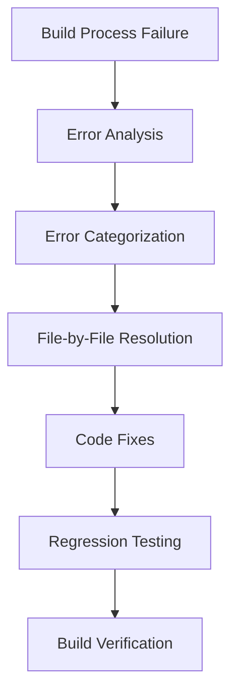

# Design Document

## Overview

This document outlines the design for fixing the TypeScript compilation errors that currently prevent the Thesis Copilot application from building successfully. The errors are occurring during the `npm run build` process, specifically in the TypeScript compilation phase. The design focuses on identifying and resolving syntax errors in specific files to allow the application to build successfully.

## Architecture

### High-Level Approach



### Error Resolution Flow

1. **Error Identification**: Parse build output to identify specific files and error types
2. **Error Categorization**: Group errors by type and file location
3. **File Resolution**: Address errors in each affected file
4. **Fix Implementation**: Apply necessary code changes
5. **Verification**: Confirm errors are resolved and no regressions are introduced

## Components and Interfaces

### Error Analysis Script

A simple script will be created to parse the TypeScript compilation errors and categorize them for efficient resolution:

```typescript
interface BuildError {
  file: string;
  line: number;
  column: number;
  errorCode: string;
  message: string;
}

interface ErrorSummary {
  files: string[];
  errorTypes: Record<string, number>;
  totalErrors: number;
}
```

### Manual Resolution Process

Since these are syntax errors, an automated fix may not be appropriate. Instead, we'll follow a manual process:

1. **File Analysis**: Examine each file with errors to understand the context
2. **Error Investigation**: Look at the specific lines mentioned in the errors
3. **Code Correction**: Fix the syntax issues
4. **Verification**: Run the build to confirm the errors are resolved

## Data Models

### Error Types

The current errors fall into several categories:

1. **TS1109: Expression expected** - Missing expression in code
2. **TS1161: Unterminated regular expression literal** - Regex not properly closed
3. **TS1128: Declaration or statement expected** - Invalid syntax where a declaration or statement is expected
4. **TS1005: ';' expected** - Missing semicolon
5. **TS1160: Unterminated template literal** - Template string not properly closed
6. **TS1010: '*/' expected** - Comment block not properly closed

## Error Handling

### Resolution Strategy

For each error type, we'll use the following resolution approaches:

1. **Expression expected (TS1109)**: Check for incomplete expressions, missing operands, or syntax errors around the indicated line
2. **Unterminated regular expression (TS1161)**: Look for unclosed regex patterns (missing closing `/`)
3. **Declaration or statement expected (TS1128)**: Check for syntax errors before the indicated line
4. **Semicolon expected (TS1005)**: Add missing semicolons or fix syntax errors in the preceding statement
5. **Unterminated template literal (TS1160)**: Check for unclosed template strings (missing closing backtick)
6. **Comment block termination (TS1010)**: Ensure all comment blocks are properly closed with `*/`

## Testing Strategy

### Verification Process

1. **Pre-fix verification**: Document the current errors by running `npm run build`
2. **Incremental testing**: After fixing errors in each file, run the build to confirm those errors are resolved
3. **Final verification**: Once all known errors are addressed, run a complete build to ensure no new errors were introduced

### Regression Testing

1. **Functional testing**: Manually test key application features to ensure they still work
2. **Existing test suite**: Run any existing automated tests to verify no regressions

## Implementation Plan

### Files to Address

1. **src/components/ui/chat.tsx** (2 errors)
2. **src/components/ui/sidebar.tsx** (28 errors)
3. **src/worker/handlers/search-analytics.ts** (1 error)

### Resolution Order

1. Start with search-analytics.ts (1 error) as it's the simplest
2. Move to chat.tsx (2 errors)
3. Finish with sidebar.tsx (28 errors) as it has the most errors

### Detailed Steps

#### src/worker/handlers/search-analytics.ts
- Error: TS1010: '*/' expected at line 6, column 11
- Likely cause: Unclosed comment block
- Fix: Find the comment block starting with `/*` and ensure it's closed with `*/`

#### src/components/ui/chat.tsx
- Error: TS1109: Expression expected at line 122, column 2
- Error: TS1161: Unterminated regular expression literal at line 122, column 3
- Likely cause: Syntax error in expression, possibly an unclosed regex
- Fix: Examine line 122 and surrounding code for syntax issues

#### src/components/ui/sidebar.tsx
- Multiple errors of types:
  - TS1128: Declaration or statement expected
  - TS1109: Expression expected
  - TS1005: ';' expected
  - TS1160: Unterminated template literal
- Likely cause: Several syntax errors throughout the file
- Fix: Systematically address each error by examining the indicated lines

## Risk Mitigation

### Potential Issues

1. **Hidden dependencies**: Fixing one error might reveal others
2. **Cascading errors**: One syntax error might cause multiple error messages
3. **Misleading line numbers**: TypeScript might report errors on lines that aren't the root cause

### Mitigation Strategies

1. **Incremental verification**: Test after each file fix to ensure we're making progress
2. **Thorough analysis**: Look at code context, not just the exact line mentioned
3. **Backup plan**: If errors persist, examine the surrounding code structure

## Success Criteria

1. **Build Success**: `npm run build` completes without TypeScript compilation errors
2. **No Regressions**: Existing functionality remains intact
3. **Code Quality**: Fixes follow existing coding patterns and conventions
4. **Documentation**: Process and findings are documented for future reference