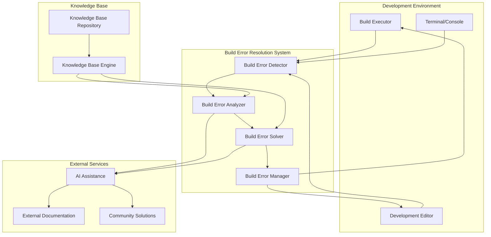

# Design Document

## Overview

The Build Error Resolution feature is designed to systematically identify, categorize, and resolve all errors that occur during the build process of the Thesis Copilot application. This feature will enhance the development workflow by providing developers with clear guidance on how to address build issues, reducing debugging time and improving code quality. The system will automatically detect build errors, analyze their root causes, and suggest or implement appropriate fixes.

The design follows the established patterns from other tools in the Thesis Copilot application, integrating seamlessly with the existing development environment while providing comprehensive error resolution capabilities.

## Architecture

### High-Level Architecture



### Component Interaction Flow

1. **Error Detection**: Build process errors are captured by the Build Error Detector
2. **Error Analysis**: Detected errors are analyzed by the Build Error Analyzer using the knowledge base
3. **Solution Generation**: The Build Error Solver generates potential solutions
4. **Solution Presentation**: Solutions are presented to the developer through the Build Error Manager
5. **Resolution Implementation**: Developers can accept solutions which are then implemented
6. **Learning**: Resolved errors and their solutions are stored in the knowledge base for future reference

## Components and Interfaces

### Frontend Components

#### 1. Build Error Manager Component
- **Location**: `src/components/ui/build-error-manager.tsx`
- **Responsibilities**:
  - Main interface for build error management
  - Coordinate error detection, analysis, and resolution
  - Manage overall build error resolution state
- **Interface**:
  ```typescript
  interface BuildErrorManagerProps {
    isOpen: boolean;
    onClose: () => void;
    currentProject: { name: string; path: string };
  }
  
  interface BuildErrorManagerState {
    errors: BuildError[];
    selectedError: BuildError | null;
    isAnalyzing: boolean;
    isResolving: boolean;
    resolutionStatus: ResolutionStatus;
    error: string | null;
  }
  ```

#### 2. Error List Component
- **Location**: `src/components/ui/error-list.tsx`
- **Responsibilities**:
  - Display list of detected build errors
  - Handle error filtering and sorting
  - Provide error selection for detailed analysis
- **Interface**:
  ```typescript
  interface ErrorListProps {
    errors: BuildError[];
    onErrorSelect: (error: BuildError) => void;
    onFilterChange: (filter: ErrorFilter) => void;
    filter: ErrorFilter;
  }
  ```

#### 3. Error Detail Component
- **Location**: `src/components/ui/error-detail.tsx`
- **Responsibilities**:
  - Display detailed error information
  - Show analysis results and suggested solutions
  - Handle solution acceptance and implementation
- **Interface**:
  ```typescript
  interface ErrorDetailProps {
    error: BuildError;
    analysis: ErrorAnalysis;
    solutions: ErrorSolution[];
    onSolutionApply: (solution: ErrorSolution) => void;
    isResolving: boolean;
  }
  ```

#### 4. Resolution Progress Component
- **Location**: `src/components/ui/resolution-progress.tsx`
- **Responsibilities**:
  - Show resolution progress and status
  - Display loading states during analysis and resolution
  - Handle resolution cancellation
- **Interface**:
  ```typescript
  interface ResolutionProgressProps {
    isAnalyzing: boolean;
    isResolving: boolean;
    progress: number;
    statusMessage: string;
    onCancel: () => void;
  }
  ```

### Backend Components

#### 1. Build Error Handler
- **Location**: `src/worker/handlers/build-error-handler.ts`
- **Responsibilities**:
  - Handle build error detection and reporting
  - Coordinate with error analysis engine
  - Manage error resolution requests
- **Endpoints**:
  ```typescript
  POST /api/build-errors/detect
  GET /api/build-errors/:projectId
  POST /api/build-errors/analyze
  POST /api/build-errors/resolve
  ```

#### 2. Error Analysis Engine
- **Location**: `src/worker/lib/error-analysis-engine.ts`
- **Responsibilities**:
  - Analyze build errors to determine root causes
  - Generate detailed error explanations
  - Interface with knowledge base for solutions
- **Interface**:
  ```typescript
  interface ErrorAnalysisEngine {
    analyzeError(error: BuildError): Promise<ErrorAnalysis>;
    categorizeError(error: BuildError): Promise<ErrorCategory>;
    getDetailedExplanation(error: BuildError): Promise<string>;
  }
  ```

#### 3. Solution Engine
- **Location**: `src/worker/lib/solution-engine.ts`
- **Responsibilities**:
  - Generate potential solutions for build errors
  - Rank solutions by effectiveness and safety
  - Provide implementation guidance
- **Interface**:
  ```typescript
  interface SolutionEngine {
    generateSolutions(error: BuildError, analysis: ErrorAnalysis): Promise<ErrorSolution[]>;
    rankSolutions(solutions: ErrorSolution[]): Promise<ErrorSolution[]>;
    implementSolution(solution: ErrorSolution): Promise<ResolutionResult>;
  }
  ```

#### 4. Knowledge Base Manager
- **Location**: `src/worker/lib/knowledge-base-manager.ts`
- **Responsibilities**:
  - Manage the knowledge base of known errors and solutions
  - Store newly resolved errors and solutions
  - Provide search capabilities for error information
- **Interface**:
  ```typescript
  interface KnowledgeBaseManager {
    searchError(errorSignature: string): Promise<KnowledgeBaseEntry[]>;
    addEntry(entry: KnowledgeBaseEntry): Promise<void>;
    updateEntry(entry: KnowledgeBaseEntry): Promise<void>;
    getStatistics(): Promise<KnowledgeBaseStatistics>;
  }
  ```

## Data Models

### Build Error Models

```typescript
interface BuildError {
  id: string;
  projectId: string;
  type: ErrorType;
  message: string;
  file?: string;
  line?: number;
  column?: number;
  stackTrace?: string;
  severity: ErrorSeverity;
  category: ErrorCategory;
  timestamp: Date;
  resolved: boolean;
  resolution?: ErrorResolution;
}

enum ErrorType {
  SYNTAX = 'syntax',
  TYPE = 'type',
  DEPENDENCY = 'dependency',
  CONFIGURATION = 'configuration',
  ENVIRONMENT = 'environment',
  OTHER = 'other'
}

enum ErrorSeverity {
  LOW = 'low',
  MEDIUM = 'medium',
  HIGH = 'high',
  CRITICAL = 'critical'
}

enum ErrorCategory {
  COMPILATION = 'compilation',
  LINKING = 'linking',
  PACKAGING = 'packaging',
  TESTING = 'testing',
  DEPLOYMENT = 'deployment'
}
```

### Error Analysis Models

```typescript
interface ErrorAnalysis {
  errorId: string;
  rootCause: string;
  contributingFactors: string[];
  explanation: string;
  relatedErrors: string[];
  confidence: number; // 0-1 scale
  analysisTime: number;
  toolsUsed: string[];
}

interface ErrorSolution {
  id: string;
  errorId: string;
  description: string;
  steps: SolutionStep[];
  effectiveness: number; // 0-1 scale
  riskLevel: RiskLevel;
  estimatedTime: number; // minutes
  automated: boolean;
}

enum RiskLevel {
  LOW = 'low',
  MEDIUM = 'medium',
  HIGH = 'high'
}

interface SolutionStep {
  step: number;
  description: string;
  file?: string;
  line?: number;
  codeChange?: CodeChange;
}

interface CodeChange {
  before: string;
  after: string;
  language: string;
}
```

### Knowledge Base Models

```typescript
interface KnowledgeBaseEntry {
  id: string;
  errorSignature: string;
  errorType: ErrorType;
  errorMessagePattern: string;
  rootCause: string;
  solutions: ErrorSolution[];
  source: KnowledgeSource;
  createdAt: Date;
  updatedAt: Date;
  popularity: number; // Number of times used
  successRate: number; // 0-1 scale
}

enum KnowledgeSource {
  INTERNAL = 'internal',
  COMMUNITY = 'community',
  DOCUMENTATION = 'documentation',
  AI_GENERATED = 'ai_generated'
}

interface KnowledgeBaseStatistics {
  totalEntries: number;
  entriesByType: Record<ErrorType, number>;
  mostCommonErrors: KnowledgeBaseEntry[];
  successRate: number;
  lastUpdated: Date;
}
```

### Resolution Models

```typescript
interface ErrorResolution {
  errorId: string;
  solutionId: string;
  resolvedBy: string;
  resolvedAt: Date;
  stepsTaken: ResolutionStep[];
  success: boolean;
  notes?: string;
}

interface ResolutionStep {
  step: number;
  description: string;
  completed: boolean;
  timestamp: Date;
}

interface ResolutionResult {
  success: boolean;
  message: string;
  changesMade: FileChange[];
  nextSteps?: string[];
}

interface FileChange {
  filePath: string;
  changeType: ChangeType;
  contentBefore?: string;
  contentAfter?: string;
}

enum ChangeType {
  CREATED = 'created',
  MODIFIED = 'modified',
  DELETED = 'deleted'
}
```

## Error Handling

### Frontend Error Handling

1. **Detection Errors**: Graceful handling when build errors cannot be captured
2. **Analysis Errors**: Display user-friendly error messages when analysis fails
3. **Resolution Errors**: Provide rollback mechanisms when solution implementation fails
4. **Network Errors**: Handle connectivity issues with offline indicators

### Backend Error Handling

1. **Analysis Engine Failures**: Implement fallback to basic error explanations
2. **Solution Engine Failures**: Provide alternative solutions or manual guidance
3. **Knowledge Base Errors**: Graceful degradation when knowledge base is unavailable
4. **External Service Failures**: Handle failures in external documentation or community sources

### Error Recovery Strategies

```typescript
interface ErrorRecoveryStrategy {
  detectionFailure: {
    fallbackToBasicParsing: boolean;
    notifyUser: boolean;
    logError: boolean;
  };
  analysisFailure: {
    useCachedAnalysis: boolean;
    provideGenericSolution: boolean;
    notifyUser: boolean;
  };
  resolutionFailure: {
    rollbackChanges: boolean;
    provideManualSteps: boolean;
    notifyUser: boolean;
  };
}
```

## Testing Strategy

### Unit Testing

1. **Error Detection**:
   - Test error parsing from different build tools
   - Test error categorization logic
   - Test error filtering and sorting

2. **Error Analysis**:
   - Test root cause determination
   - Test explanation generation
   - Test knowledge base integration

3. **Solution Generation**:
   - Test solution creation algorithms
   - Test solution ranking
   - Test implementation guidance

### Integration Testing

1. **Build Tool Integration**:
   - Test error detection from various build tools
   - Test real-time error reporting
   - Test error correlation across tools

2. **Knowledge Base Integration**:
   - Test knowledge base search functionality
   - Test entry creation and updates
   - Test statistics generation

3. **External Service Integration**:
   - Test documentation retrieval
   - Test community solution integration
   - Test AI assistance integration

### End-to-End Testing

1. **Complete Resolution Workflow**:
   - Test full error detection to resolution process
   - Test solution implementation
   - Test learning from resolved errors

2. **User Experience Testing**:
   - Test interface usability
   - Test error recovery
   - Test performance with large codebases

### Testing Implementation

```typescript
describe('Build Error Resolution', () => {
  describe('Error Detection', () => {
    it('should detect syntax errors correctly', async () => {
      // Test implementation
    });
    
    it('should categorize errors appropriately', async () => {
      // Test implementation
    });
  });
  
  describe('Error Analysis', () => {
    it('should determine root causes accurately', async () => {
      // Test implementation
    });
    
    it('should generate helpful explanations', () => {
      // Test implementation
    });
  });
  
  describe('Solution Generation', () => {
    it('should create relevant solutions', async () => {
      // Test implementation
    });
    
    it('should rank solutions effectively', () => {
      // Test implementation
    });
  });
});
```

## Performance Considerations

### Frontend Performance

1. **Lazy Loading**: Load error resolution components only when needed
2. **Virtual Scrolling**: Handle large numbers of errors efficiently
3. **Debounced Updates**: Prevent excessive analysis requests
4. **Caching**: Cache analysis results for repeated errors

### Backend Performance

1. **Analysis Optimization**: Optimize error analysis algorithms
2. **Batch Processing**: Process multiple errors in batches
3. **Caching Strategy**: Cache knowledge base lookups
4. **Database Optimization**: Optimize queries for error retrieval

### Knowledge Base Performance

1. **Indexing**: Proper indexing of error signatures and solutions
2. **Search Optimization**: Efficient search algorithms for error matching
3. **Entry Prioritization**: Prioritize frequently used solutions
4. **Data Compression**: Compress knowledge base entries when appropriate

## Security Considerations

### Input Validation

1. **Error Message Sanitization**: Sanitize error messages before processing
2. **File Path Validation**: Validate file paths to prevent directory traversal
3. **Code Change Validation**: Validate code changes before application

### API Security

1. **Rate Limiting**: Implement proper rate limiting for analysis endpoints
2. **Authentication**: Ensure proper user authentication for error resolution features
3. **Data Validation**: Validate all incoming requests

### Data Privacy

1. **Error Content Encryption**: Encrypt sensitive error information
2. **Audit Logging**: Log error resolution interactions for security monitoring
3. **Data Retention**: Implement proper data retention policies for error data

## Integration Points

### Existing System Integration

1. **Build Tool Integration**: Capture errors from existing build processes
2. **Development Environment Integration**: Integrate with code editors and IDEs
3. **Database Integration**: Store errors and resolutions in existing database
4. **UI Component Reuse**: Use existing Sheet, Button, and other UI components

### External Service Integration

1. **Documentation Sources**: Integrate with external documentation for solutions
2. **Community Platforms**: Retrieve solutions from community platforms
3. **AI Services**: Use AI for enhanced error analysis and solution generation
4. **Package Registries**: Check for dependency-related solutions

## Deployment Considerations

### Environment Configuration

1. **External Service Configuration**: Proper setup of documentation and community service credentials
2. **Feature Flags**: Implement feature flags for gradual rollout
3. **Performance Monitoring**: Monitor analysis performance and solution effectiveness

### Rollout Strategy

1. **Phased Rollout**: Gradual rollout of error resolution features
2. **User Feedback**: Collect and incorporate user feedback
3. **Performance Monitoring**: Monitor system performance and user adoption

## Database Schema and Migrations

### Migration Strategy

The build error resolution functionality requires new database tables for error tracking, analysis, and resolution:

#### Migration: Create Build Error Tables

```sql
-- Migration version: v5
-- Description: Create build error tables for error tracking and resolution

-- Create error types enum
CREATE TYPE error_type AS ENUM (
  'syntax',
  'type',
  'dependency',
  'configuration',
  'environment',
  'other'
);

-- Create error severity enum
CREATE TYPE error_severity AS ENUM (
  'low',
  'medium',
  'high',
  'critical'
);

-- Create error categories enum
CREATE TYPE error_category AS ENUM (
  'compilation',
  'linking',
  'packaging',
  'testing',
  'deployment'
);

-- Create build errors table
CREATE TABLE build_errors (
  id UUID PRIMARY KEY DEFAULT gen_random_uuid(),
  project_id UUID NOT NULL REFERENCES projects(id) ON DELETE CASCADE,
  type error_type NOT NULL,
  message TEXT NOT NULL,
  file TEXT,
  line INTEGER,
  column INTEGER,
  stack_trace TEXT,
  severity error_severity NOT NULL,
  category error_category NOT NULL,
  timestamp TIMESTAMP WITH TIME ZONE DEFAULT NOW(),
  resolved BOOLEAN NOT NULL DEFAULT FALSE,
  resolution_id UUID REFERENCES error_resolutions(id)
);

-- Create error resolutions table
CREATE TABLE error_resolutions (
  id UUID PRIMARY KEY DEFAULT gen_random_uuid(),
  error_id UUID NOT NULL REFERENCES build_errors(id) ON DELETE CASCADE,
  solution_id UUID,
  resolved_by TEXT NOT NULL,
  resolved_at TIMESTAMP WITH TIME ZONE DEFAULT NOW(),
  success BOOLEAN NOT NULL DEFAULT TRUE,
  notes TEXT
);

-- Create knowledge base entries table
CREATE TABLE knowledge_base_entries (
  id UUID PRIMARY KEY DEFAULT gen_random_uuid(),
  error_signature TEXT NOT NULL,
  error_type error_type NOT NULL,
  error_message_pattern TEXT NOT NULL,
  root_cause TEXT NOT NULL,
  solutions JSONB NOT NULL DEFAULT '[]',
  source TEXT NOT NULL,
  popularity INTEGER DEFAULT 0,
  success_rate DECIMAL(3,2) DEFAULT 1.0,
  created_at TIMESTAMP WITH TIME ZONE DEFAULT NOW(),
  updated_at TIMESTAMP WITH TIME ZONE DEFAULT NOW()
);

-- Create indexes for performance
CREATE INDEX idx_build_errors_project_id ON build_errors(project_id);
CREATE INDEX idx_build_errors_type ON build_errors(type);
CREATE INDEX idx_build_errors_severity ON build_errors(severity);
CREATE INDEX idx_build_errors_category ON build_errors(category);
CREATE INDEX idx_build_errors_timestamp ON build_errors(timestamp);
CREATE INDEX idx_build_errors_resolved ON build_errors(resolved);

CREATE INDEX idx_error_resolutions_error_id ON error_resolutions(error_id);
CREATE INDEX idx_error_resolutions_resolved_at ON error_resolutions(resolved_at);

CREATE INDEX idx_knowledge_base_entries_error_signature ON knowledge_base_entries(error_signature);
CREATE INDEX idx_knowledge_base_entries_error_type ON knowledge_base_entries(error_type);
CREATE INDEX idx_knowledge_base_entries_popularity ON knowledge_base_entries(popularity);
CREATE INDEX idx_knowledge_base_entries_success_rate ON knowledge_base_entries(success_rate);

-- Create trigger to update updated_at timestamp
CREATE OR REPLACE FUNCTION update_updated_at_column()
RETURNS TRIGGER AS $$
BEGIN
    NEW.updated_at = NOW();
    RETURN NEW;
END;
$$ language 'plpgsql';

CREATE TRIGGER update_knowledge_base_entries_updated_at 
    BEFORE UPDATE ON knowledge_base_entries 
    FOR EACH ROW EXECUTE FUNCTION update_updated_at_column();
```

### Complete Database Schema (new_db.sql)

For fresh installations, a complete database setup file should include all existing and new tables:

```sql
-- Complete database schema for Thesis Copilot application
-- This file creates all necessary tables and relationships

-- Enable UUID extension
CREATE EXTENSION IF NOT EXISTS "uuid-ossp";

-- Create projects table
CREATE TABLE projects (
  id UUID PRIMARY KEY DEFAULT uuid_generate_v4(),
  name TEXT NOT NULL,
  path TEXT NOT NULL,
  created_at TIMESTAMP WITH TIME ZONE DEFAULT NOW(),
  updated_at TIMESTAMP WITH TIME ZONE DEFAULT NOW()
);

-- Create build errors table
CREATE TABLE build_errors (
  id UUID PRIMARY KEY DEFAULT uuid_generate_v4(),
  project_id UUID NOT NULL REFERENCES projects(id) ON DELETE CASCADE,
  type error_type NOT NULL,
  message TEXT NOT NULL,
  file TEXT,
  line INTEGER,
  column INTEGER,
  stack_trace TEXT,
  severity error_severity NOT NULL,
  category error_category NOT NULL,
  timestamp TIMESTAMP WITH TIME ZONE DEFAULT NOW(),
  resolved BOOLEAN NOT NULL DEFAULT FALSE,
  resolution_id UUID REFERENCES error_resolutions(id)
);

-- Create error resolutions table
CREATE TABLE error_resolutions (
  id UUID PRIMARY KEY DEFAULT uuid_generate_v4(),
  error_id UUID NOT NULL REFERENCES build_errors(id) ON DELETE CASCADE,
  solution_id UUID,
  resolved_by TEXT NOT NULL,
  resolved_at TIMESTAMP WITH TIME ZONE DEFAULT NOW(),
  success BOOLEAN NOT NULL DEFAULT TRUE,
  notes TEXT
);

-- Create knowledge base entries table
CREATE TABLE knowledge_base_entries (
  id UUID PRIMARY KEY DEFAULT uuid_generate_v4(),
  error_signature TEXT NOT NULL,
  error_type error_type NOT NULL,
  error_message_pattern TEXT NOT NULL,
  root_cause TEXT NOT NULL,
  solutions JSONB NOT NULL DEFAULT '[]',
  source TEXT NOT NULL,
  popularity INTEGER DEFAULT 0,
  success_rate DECIMAL(3,2) DEFAULT 1.0,
  created_at TIMESTAMP WITH TIME ZONE DEFAULT NOW(),
  updated_at TIMESTAMP WITH TIME ZONE DEFAULT NOW()
);

-- Create all indexes
CREATE INDEX idx_projects_created_at ON projects(created_at);

CREATE INDEX idx_build_errors_project_id ON build_errors(project_id);
CREATE INDEX idx_build_errors_type ON build_errors(type);
CREATE INDEX idx_build_errors_severity ON build_errors(severity);
CREATE INDEX idx_build_errors_category ON build_errors(category);
CREATE INDEX idx_build_errors_timestamp ON build_errors(timestamp);
CREATE INDEX idx_build_errors_resolved ON build_errors(resolved);

CREATE INDEX idx_error_resolutions_error_id ON error_resolutions(error_id);
CREATE INDEX idx_error_resolutions_resolved_at ON error_resolutions(resolved_at);

CREATE INDEX idx_knowledge_base_entries_error_signature ON knowledge_base_entries(error_signature);
CREATE INDEX idx_knowledge_base_entries_error_type ON knowledge_base_entries(error_type);
CREATE INDEX idx_knowledge_base_entries_popularity ON knowledge_base_entries(popularity);
CREATE INDEX idx_knowledge_base_entries_success_rate ON knowledge_base_entries(success_rate);

-- Create update timestamp function and triggers
CREATE OR REPLACE FUNCTION update_updated_at_column()
RETURNS TRIGGER AS $$
BEGIN
    NEW.updated_at = NOW();
    RETURN NEW;
END;
$$ language 'plpgsql';

CREATE TRIGGER update_projects_updated_at 
    BEFORE UPDATE ON projects 
    FOR EACH ROW EXECUTE FUNCTION update_updated_at_column();

CREATE TRIGGER update_knowledge_base_entries_updated_at 
    BEFORE UPDATE ON knowledge_base_entries 
    FOR EACH ROW EXECUTE FUNCTION update_updated_at_column();
```

### Migration Files Structure

The migration files should be organized as follows:

```
migrations/
├── v1_create_ideas_table.sql (existing)
├── v2_alter_ideas_table.sql (existing)  
├── v3_create_proofreading_tables.sql (existing)
├── v4_create_referencer_tables.sql (existing)
├── v5_create_build_error_tables.sql (new)
└── new_db.sql (complete schema for fresh installs)
```