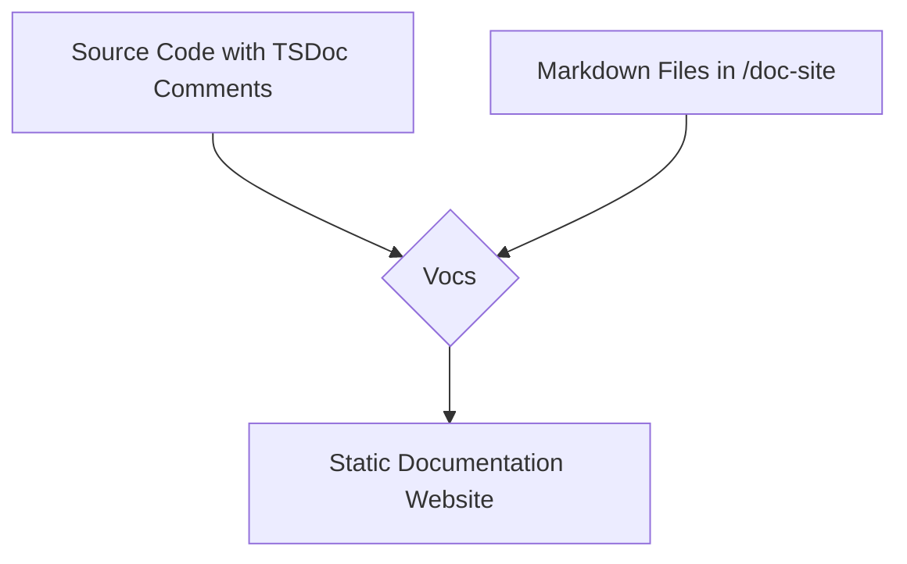

# Design Document: Comprehensive Codebase Documentation

## 1. Overview

This document outlines the design for creating and maintaining a comprehensive documentation for the Thesis Copilot codebase. The proposed solution involves a combination of in-code documentation using TSDoc, and a static documentation site generated by Vocs. This approach will ensure that the documentation is detailed, easy to maintain, and accessible to all developers.

## 2. Architecture

The documentation system will be composed of two main parts:

1.  **In-Code Documentation:** We will use the TSDoc standard for documenting all TypeScript code, including components, hooks, functions, and classes. This will provide immediate documentation within the IDE and serve as the source of truth for the generated documentation.
2.  **Documentation Site:** We will use [Vocs](https://vocs.dev/), a minimal and modern documentation generator built for React and Vite, to create a static documentation website. This site will be generated from the existing Markdown files in the `doc-site` directory and from the TSDoc comments in the source code.

The overall architecture will look like this:

## 3. Components and Interfaces

### 3.1. TSDoc Comments

All new and existing code will be documented using TSDoc. A standard format will be enforced using ESLint plugins to ensure consistency. The TSDoc comments will include:

- A summary of the function/component's purpose.
- Descriptions of all parameters (`@param`).
- Description of the return value (`@returns`).
- Example usage (`@example`).

### 3.2. Documentation Site (Vocs)

The documentation site will be built using Vocs. It will be configured to:

- **Consume Markdown files:** The existing documentation in the `docs` directory will be used to create pages on the site.
- **Generate API documentation:** We will use a tool like `typedoc` to extract the TSDoc comments from the source code and generate Markdown files that can be consumed by Vocs. This will create a comprehensive API reference.
- **Be searchable:** Vocs provides built-in search functionality, which will make it easy for developers to find the information they need.
- **Be versioned:** We can leverage Vocs's versioning capabilities to maintain documentation for different versions of the application.

## 4. Data Models

This section is not directly applicable to this feature, as we are not introducing new data models to the application itself. The "data" in this case is the documentation content, which will be stored in Markdown files and as TSDoc comments in the source code.

## 5. Error Handling

The primary source of errors will be in the documentation generation process.

- **TSDoc Parsing Errors:** If `typedoc` fails to parse the TSDoc comments, the documentation build process will fail. This will be caught in the CI/CD pipeline.
- **Broken Links:** We will use a link checker to scan the generated documentation site for broken links.

## 6. Testing Strategy

- **Linting:** We will use ESLint with TSDoc validation to ensure that all code is properly documented and that the comments follow the defined standard.
- **CI/CD Integration:** The documentation generation and testing will be integrated into the CI/CD pipeline. A new documentation site will be built and deployed automatically on every push to the main branch.
- **Manual Review:** A manual review process will be established to ensure the quality and clarity of the documentation.
