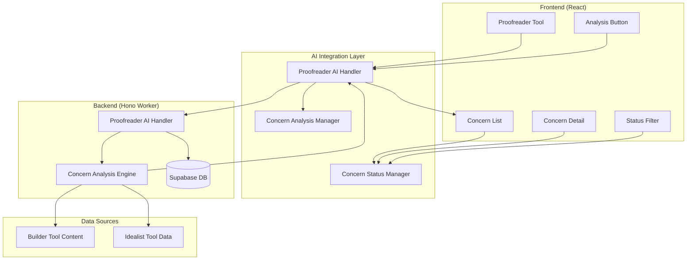

# Design Document

## Overview

The Proofreader Tool is a specialized AI-powered analysis component that provides comprehensive feedback on thesis proposals without making automatic modifications. The design follows the established patterns from the existing Idealist tool for UI consistency while integrating with the AI infrastructure used by the Builder tool. The proofreader operates as a read-only analysis system that generates structured feedback with status tracking capabilities, allowing users to manage their revision process systematically.

## Architecture

### High-Level Architecture



### Component Interaction Flow

1. **User Activation**: User opens Proofreader Tool and initiates analysis
2. **Content Retrieval**: System retrieves thesis proposal content and idea definitions
3. **AI Analysis**: Backend processes content through AI engine to identify concerns
4. **Concern Generation**: System generates structured list of concerns with descriptions
5. **Status Management**: User can update concern status and filter by status
6. **Persistence**: Concern status changes are saved to database for future sessions

## Components and Interfaces

### Frontend Components

#### 1. Proofreader Tool Component
- **Location**: `src/components/ui/proofreader.tsx`
- **Responsibilities**:
  - Main interface for proofreader functionality
  - Coordinate analysis requests and display results
  - Manage overall proofreader state
- **Interface**:
  ```typescript
  interface ProofreaderProps {
    isOpen: boolean;
    onClose: () => void;
    currentConversation: { title: string; id: string };
  }
  
  interface ProofreaderState {
    concerns: ProofreadingConcern[];
    isAnalyzing: boolean;
    lastAnalyzed: Date | null;
    statusFilter: ConcernStatus | 'all';
    error: string | null;
  }
  ```

#### 2. Concern List Component
- **Location**: `src/components/ui/concern-list.tsx`
- **Responsibilities**:
  - Display list of proofreading concerns
  - Handle status filtering and updates
  - Provide expandable concern details
- **Interface**:
  ```typescript
  interface ConcernListProps {
    concerns: ProofreadingConcern[];
    onStatusChange: (concernId: string, status: ConcernStatus) => void;
    statusFilter: ConcernStatus | 'all';
    onFilterChange: (filter: ConcernStatus | 'all') => void;
  }
  ```

#### 3. Concern Detail Component
- **Location**: `src/components/ui/concern-detail.tsx`
- **Responsibilities**:
  - Display detailed concern information
  - Handle status updates for individual concerns
  - Show concern category and severity
- **Interface**:
  ```typescript
  interface ConcernDetailProps {
    concern: ProofreadingConcern;
    onStatusChange: (status: ConcernStatus) => void;
    isExpanded: boolean;
    onToggleExpanded: () => void;
  }
  ```

#### 4. Analysis Progress Component
- **Location**: `src/components/ui/analysis-progress.tsx`
- **Responsibilities**:
  - Show analysis progress and status
  - Display loading states during AI processing
  - Handle analysis cancellation
- **Interface**:
  ```typescript
  interface AnalysisProgressProps {
    isAnalyzing: boolean;
    progress: number;
    statusMessage: string;
    onCancel: () => void;
  }
  ```

### Backend Components

#### 1. Proofreader AI Handler
- **Location**: `src/worker/handlers/proofreader-ai.ts`
- **Responsibilities**:
  - Handle proofreading analysis requests
  - Coordinate with AI service for concern generation
  - Manage concern persistence and retrieval
- **Endpoints**:
  ```typescript
  POST /api/proofreader/analyze
  GET /api/proofreader/concerns/:conversationId
  PUT /api/proofreader/concerns/:concernId/status
  ```

#### 2. Concern Analysis Engine
- **Location**: `src/worker/lib/concern-analysis-engine.ts`
- **Responsibilities**:
  - Process thesis content through AI for analysis
  - Generate structured concern objects
  - Categorize and prioritize concerns
- **Interface**:
  ```typescript
  interface ConcernAnalysisEngine {
    analyzeContent(content: string, ideaDefinitions: IdeaDefinition[]): Promise<ProofreadingConcern[]>;
    categorizeContent(content: string): Promise<ContentAnalysis>;
    validateAcademicStyle(content: string): Promise<AcademicStyleAnalysis>;
  }
  ```

#### 3. Concern Status Manager
- **Location**: `src/worker/lib/concern-status-manager.ts`
- **Responsibilities**:
  - Manage concern status updates
  - Handle status persistence
  - Provide status filtering capabilities
- **Interface**:
  ```typescript
  interface ConcernStatusManager {
    updateConcernStatus(concernId: string, status: ConcernStatus): Promise<void>;
    getConcernsByStatus(conversationId: string, status?: ConcernStatus): Promise<ProofreadingConcern[]>;
    getConcernStatistics(conversationId: string): Promise<ConcernStatistics>;
  }
  ```

## Data Models

### Proofreading Concern Models

```typescript
interface ProofreadingConcern {
  id: string;
  conversationId: string;
  category: ConcernCategory;
  severity: ConcernSeverity;
  title: string;
  description: string;
  location?: ContentLocation;
  suggestions?: string[];
  relatedIdeas?: string[]; // References to idea definitions
  status: ConcernStatus;
  createdAt: Date;
  updatedAt: Date;
}

enum ConcernCategory {
  CLARITY = 'clarity',
  COHERENCE = 'coherence',
  STRUCTURE = 'structure',
  ACADEMIC_STYLE = 'academic_style',
  CONSISTENCY = 'consistency',
  COMPLETENESS = 'completeness',
  CITATIONS = 'citations',
  GRAMMAR = 'grammar',
  TERMINOLOGY = 'terminology'
}

enum ConcernSeverity {
  LOW = 'low',
  MEDIUM = 'medium',
  HIGH = 'high',
  CRITICAL = 'critical'
}

enum ConcernStatus {
  TO_BE_DONE = 'to_be_done',
  ADDRESSED = 'addressed',
  REJECTED = 'rejected'
}

interface ContentLocation {
  section?: string;
  paragraph?: number;
  startPosition?: number;
  endPosition?: number;
  context?: string; // Surrounding text for reference
}
```

### Analysis Request/Response Models

```typescript
interface ProofreaderAnalysisRequest {
  conversationId: string;
  documentContent: string;
  ideaDefinitions: IdeaDefinition[];
  analysisOptions?: AnalysisOptions;
}

interface AnalysisOptions {
  categories?: ConcernCategory[];
  minSeverity?: ConcernSeverity;
  includeGrammar?: boolean;
  academicLevel?: 'undergraduate' | 'graduate' | 'doctoral';
}

interface ProofreaderAnalysisResponse {
  success: boolean;
  concerns?: ProofreadingConcern[];
  analysisMetadata?: AnalysisMetadata;
  error?: string;
}

interface AnalysisMetadata {
  totalConcerns: number;
  concernsByCategory: Record<ConcernCategory, number>;
  concernsBySeverity: Record<ConcernSeverity, number>;
  analysisTime: number;
  contentLength: number;
  ideaDefinitionsUsed: number;
}
```

### Status Management Models

```typescript
interface ConcernStatusUpdate {
  concernId: string;
  status: ConcernStatus;
  updatedBy?: string;
  notes?: string;
}

interface ConcernStatistics {
  total: number;
  toBeDone: number;
  addressed: number;
  rejected: number;
  byCategory: Record<ConcernCategory, ConcernStatusBreakdown>;
  bySeverity: Record<ConcernSeverity, ConcernStatusBreakdown>;
}

interface ConcernStatusBreakdown {
  total: number;
  toBeDone: number;
  addressed: number;
  rejected: number;
}
```

### Content Analysis Models

```typescript
interface ContentAnalysis {
  structure: StructureAnalysis;
  style: StyleAnalysis;
  consistency: ConsistencyAnalysis;
  completeness: CompletenessAnalysis;
}

interface StructureAnalysis {
  hasIntroduction: boolean;
  hasConclusion: boolean;
  sectionFlow: FlowAnalysis;
  headingHierarchy: HeadingAnalysis;
}

interface StyleAnalysis {
  academicTone: number; // 0-1 scale
  formalityLevel: number; // 0-1 scale
  clarityScore: number; // 0-1 scale
  styleIssues: StyleIssue[];
}

interface ConsistencyAnalysis {
  terminologyConsistency: TerminologyIssue[];
  citationConsistency: CitationIssue[];
  formattingConsistency: FormattingIssue[];
}

interface CompletenessAnalysis {
  missingSections: string[];
  insufficientDetail: string[];
  completenessScore: number; // 0-1 scale
}
```

## Error Handling

### Frontend Error Handling

1. **Analysis Errors**: Display user-friendly error messages with retry options
2. **Network Errors**: Handle connectivity issues with offline indicators
3. **Status Update Errors**: Provide immediate feedback and rollback on failure
4. **Content Loading Errors**: Graceful degradation when content cannot be retrieved

### Backend Error Handling

1. **AI Service Failures**: Implement retry logic with exponential backoff
2. **Database Errors**: Proper error logging and user notification
3. **Content Processing Errors**: Fallback to basic analysis when advanced features fail
4. **Rate Limiting**: Implement proper rate limiting and user feedback

### Error Recovery Strategies

```typescript
interface ProofreaderErrorRecovery {
  analysisFailure: {
    retryAttempts: number;
    fallbackToBasicAnalysis: boolean;
    notifyUser: boolean;
  };
  statusUpdateFailure: {
    rollbackChanges: boolean;
    retryAttempts: number;
    offlineQueue: boolean;
  };
  contentRetrievalFailure: {
    useCache: boolean;
    promptUserRefresh: boolean;
    degradeGracefully: boolean;
  };
}
```

## Testing Strategy

### Unit Testing

1. **Concern Analysis Engine**:
   - Test concern generation accuracy
   - Test categorization logic
   - Test severity assessment

2. **Status Management**:
   - Test status updates
   - Test filtering functionality
   - Test persistence

3. **UI Components**:
   - Test concern display
   - Test status interactions
   - Test filtering and sorting

### Integration Testing

1. **AI Service Integration**:
   - Test analysis request processing
   - Test concern generation
   - Test error handling

2. **Database Integration**:
   - Test concern persistence
   - Test status updates
   - Test retrieval operations

3. **Content Integration**:
   - Test Builder tool content retrieval
   - Test Idealist integration
   - Test context building

### End-to-End Testing

1. **Complete Analysis Workflow**:
   - Test full analysis process
   - Test concern management
   - Test status tracking

2. **User Experience Testing**:
   - Test interface consistency
   - Test error recovery
   - Test performance

### Testing Implementation

```typescript
describe('Proofreader Tool', () => {
  describe('Concern Analysis', () => {
    it('should generate relevant concerns for thesis content', async () => {
      // Test implementation
    });
    
    it('should categorize concerns correctly', async () => {
      // Test implementation
    });
    
    it('should integrate idea definitions in analysis', async () => {
      // Test implementation
    });
  });
  
  describe('Status Management', () => {
    it('should update concern status correctly', async () => {
      // Test implementation
    });
    
    it('should filter concerns by status', () => {
      // Test implementation
    });
    
    it('should persist status changes', async () => {
      // Test implementation
    });
  });
});
```

## Performance Considerations

### Frontend Performance

1. **Lazy Loading**: Load proofreader components only when needed
2. **Virtual Scrolling**: Handle large numbers of concerns efficiently
3. **Debounced Updates**: Prevent excessive status update requests
4. **Caching**: Cache analysis results for repeated access

### Backend Performance

1. **Analysis Optimization**: Optimize AI prompts for faster processing
2. **Batch Processing**: Process multiple concerns in batches
3. **Caching Strategy**: Cache analysis results for similar content
4. **Database Optimization**: Optimize queries for concern retrieval

### AI Service Optimization

1. **Prompt Engineering**: Optimize prompts for comprehensive analysis
2. **Context Management**: Efficient context building for AI requests
3. **Response Processing**: Stream analysis results for better UX
4. **Token Management**: Optimize token usage for cost efficiency

## Security Considerations

### Input Validation

1. **Content Sanitization**: Sanitize thesis content before AI processing
2. **Status Validation**: Validate status updates before persistence
3. **Access Control**: Ensure users can only access their own concerns

### API Security

1. **Rate Limiting**: Implement proper rate limiting for analysis endpoints
2. **Authentication**: Ensure proper user authentication for proofreader features
3. **Data Validation**: Validate all incoming requests

### Data Privacy

1. **Content Encryption**: Encrypt sensitive thesis content
2. **Audit Logging**: Log proofreader interactions for security monitoring
3. **Data Retention**: Implement proper data retention policies for concerns

## Integration Points

### Existing System Integration

1. **Builder Tool Integration**: Retrieve current thesis proposal content
2. **Idealist Integration**: Use idea definitions for contextual analysis
3. **Conversation Context**: Use current conversation for relevant analysis
4. **Database Integration**: Store concerns and status in existing database

### External Service Integration

1. **Google Generative AI**: Primary AI service for content analysis
2. **Supabase**: Database for storing concerns and status
3. **Existing UI Components**: Reuse Sheet, Button, and other UI components

## Deployment Considerations

### Environment Configuration

1. **AI Service Configuration**: Proper setup of AI service credentials
2. **Feature Flags**: Implement feature flags for gradual rollout
3. **Performance Monitoring**: Monitor analysis performance and costs

### Rollout Strategy

1. **Phased Rollout**: Gradual rollout of proofreader features
2. **User Feedback**: Collect and incorporate user feedback
3. **Performance Monitoring**: Monitor system performance and user adoption

## Database Schema and Migrations

### Migration Strategy

The proofreader functionality requires new database tables and relationships. Based on the existing database structure (chats, messages, ideas tables), the following migrations are needed:

#### Migration v3: Create Proofreading Tables

```sql
-- Migration version: v3
-- Description: Create proofreading tables for concern tracking and analysis sessions

-- Create concern categories enum
CREATE TYPE concern_category AS ENUM (
  'clarity',
  'coherence', 
  'structure',
  'academic_style',
  'consistency',
  'completeness',
  'citations',
  'grammar',
  'terminology'
);

-- Create concern severity enum
CREATE TYPE concern_severity AS ENUM (
  'low',
  'medium',
  'high',
  'critical'
);

-- Create concern status enum
CREATE TYPE concern_status AS ENUM (
  'to_be_done',
  'addressed',
  'rejected'
);

-- Create proofreading concerns table
CREATE TABLE proofreading_concerns (
  id UUID PRIMARY KEY DEFAULT gen_random_uuid(),
  conversation_id UUID NOT NULL REFERENCES chats(id) ON DELETE CASCADE,
  category concern_category NOT NULL,
  severity concern_severity NOT NULL,
  title TEXT NOT NULL,
  description TEXT NOT NULL,
  location JSONB,
  suggestions TEXT[],
  related_ideas TEXT[],
  status concern_status NOT NULL DEFAULT 'to_be_done',
  created_at TIMESTAMP WITH TIME ZONE DEFAULT NOW(),
  updated_at TIMESTAMP WITH TIME ZONE DEFAULT NOW()
);

-- Create proofreading sessions table for tracking analysis runs
CREATE TABLE proofreading_sessions (
  id UUID PRIMARY KEY DEFAULT gen_random_uuid(),
  conversation_id UUID NOT NULL REFERENCES chats(id) ON DELETE CASCADE,
  content_hash VARCHAR(64) NOT NULL,
  analysis_metadata JSONB,
  concerns_generated INTEGER DEFAULT 0,
  created_at TIMESTAMP WITH TIME ZONE DEFAULT NOW()
);

-- Create indexes for performance
CREATE INDEX idx_proofreading_concerns_conversation_id ON proofreading_concerns(conversation_id);
CREATE INDEX idx_proofreading_concerns_status ON proofreading_concerns(status);
CREATE INDEX idx_proofreading_concerns_category ON proofreading_concerns(category);
CREATE INDEX idx_proofreading_concerns_severity ON proofreading_concerns(severity);
CREATE INDEX idx_proofreading_concerns_created_at ON proofreading_concerns(created_at);

CREATE INDEX idx_proofreading_sessions_conversation_id ON proofreading_sessions(conversation_id);
CREATE INDEX idx_proofreading_sessions_content_hash ON proofreading_sessions(content_hash);
CREATE INDEX idx_proofreading_sessions_created_at ON proofreading_sessions(created_at);

-- Create trigger to update updated_at timestamp
CREATE OR REPLACE FUNCTION update_updated_at_column()
RETURNS TRIGGER AS $$
BEGIN
    NEW.updated_at = NOW();
    RETURN NEW;
END;
$$ language 'plpgsql';

CREATE TRIGGER update_proofreading_concerns_updated_at 
    BEFORE UPDATE ON proofreading_concerns 
    FOR EACH ROW EXECUTE FUNCTION update_updated_at_column();
```

### Complete Database Schema (new_db.sql)

For fresh installations, a complete database setup file should include all existing and new tables:

```sql
-- Complete database schema for Thesis Copilot application
-- This file creates all necessary tables and relationships

-- Enable UUID extension
CREATE EXTENSION IF NOT EXISTS "uuid-ossp";

-- Create chats table (main conversations)
CREATE TABLE chats (
  id UUID PRIMARY KEY DEFAULT uuid_generate_v4(),
  name TEXT NOT NULL,
  created_at TIMESTAMP WITH TIME ZONE DEFAULT NOW(),
  updated_at TIMESTAMP WITH TIME ZONE DEFAULT NOW()
);

-- Create messages table
CREATE TABLE messages (
  id UUID PRIMARY KEY DEFAULT uuid_generate_v4(),
  chat_id UUID NOT NULL REFERENCES chats(id) ON DELETE CASCADE,
  message_id TEXT NOT NULL,
  role TEXT NOT NULL CHECK (role IN ('user', 'assistant', 'system')),
  content TEXT NOT NULL,
  created_at TIMESTAMP WITH TIME ZONE DEFAULT NOW()
);

-- Create ideas table
CREATE TABLE ideas (
  id BIGSERIAL PRIMARY KEY,
  title VARCHAR(255) NOT NULL,
  description TEXT,
  conversationid UUID REFERENCES chats(id) ON DELETE SET NULL,
  created_at TIMESTAMP WITH TIME ZONE DEFAULT NOW(),
  updated_at TIMESTAMP WITH TIME ZONE DEFAULT NOW()
);

-- Create enums for proofreading
CREATE TYPE concern_category AS ENUM (
  'clarity',
  'coherence', 
  'structure',
  'academic_style',
  'consistency',
  'completeness',
  'citations',
  'grammar',
  'terminology'
);

CREATE TYPE concern_severity AS ENUM (
  'low',
  'medium',
  'high',
  'critical'
);

CREATE TYPE concern_status AS ENUM (
  'to_be_done',
  'addressed',
  'rejected'
);

-- Create proofreading concerns table
CREATE TABLE proofreading_concerns (
  id UUID PRIMARY KEY DEFAULT uuid_generate_v4(),
  conversation_id UUID NOT NULL REFERENCES chats(id) ON DELETE CASCADE,
  category concern_category NOT NULL,
  severity concern_severity NOT NULL,
  title TEXT NOT NULL,
  description TEXT NOT NULL,
  location JSONB,
  suggestions TEXT[],
  related_ideas TEXT[],
  status concern_status NOT NULL DEFAULT 'to_be_done',
  created_at TIMESTAMP WITH TIME ZONE DEFAULT NOW(),
  updated_at TIMESTAMP WITH TIME ZONE DEFAULT NOW()
);

-- Create proofreading sessions table
CREATE TABLE proofreading_sessions (
  id UUID PRIMARY KEY DEFAULT uuid_generate_v4(),
  conversation_id UUID NOT NULL REFERENCES chats(id) ON DELETE CASCADE,
  content_hash VARCHAR(64) NOT NULL,
  analysis_metadata JSONB,
  concerns_generated INTEGER DEFAULT 0,
  created_at TIMESTAMP WITH TIME ZONE DEFAULT NOW()
);

-- Create all indexes
CREATE INDEX idx_chats_created_at ON chats(created_at);
CREATE INDEX idx_messages_chat_id ON messages(chat_id);
CREATE INDEX idx_messages_created_at ON messages(created_at);
CREATE INDEX idx_ideas_conversationid ON ideas(conversationid);
CREATE INDEX idx_ideas_created_at ON ideas(created_at);

CREATE INDEX idx_proofreading_concerns_conversation_id ON proofreading_concerns(conversation_id);
CREATE INDEX idx_proofreading_concerns_status ON proofreading_concerns(status);
CREATE INDEX idx_proofreading_concerns_category ON proofreading_concerns(category);
CREATE INDEX idx_proofreading_concerns_severity ON proofreading_concerns(severity);
CREATE INDEX idx_proofreading_concerns_created_at ON proofreading_concerns(created_at);

CREATE INDEX idx_proofreading_sessions_conversation_id ON proofreading_sessions(conversation_id);
CREATE INDEX idx_proofreading_sessions_content_hash ON proofreading_sessions(content_hash);
CREATE INDEX idx_proofreading_sessions_created_at ON proofreading_sessions(created_at);

-- Create update timestamp function and triggers
CREATE OR REPLACE FUNCTION update_updated_at_column()
RETURNS TRIGGER AS $$
BEGIN
    NEW.updated_at = NOW();
    RETURN NEW;
END;
$$ language 'plpgsql';

CREATE TRIGGER update_chats_updated_at 
    BEFORE UPDATE ON chats 
    FOR EACH ROW EXECUTE FUNCTION update_updated_at_column();

CREATE TRIGGER update_ideas_updated_at 
    BEFORE UPDATE ON ideas 
    FOR EACH ROW EXECUTE FUNCTION update_updated_at_column();

CREATE TRIGGER update_proofreading_concerns_updated_at 
    BEFORE UPDATE ON proofreading_concerns 
    FOR EACH ROW EXECUTE FUNCTION update_updated_at_column();
```

### Migration Files Structure

The migration files should be organized as follows:

```
migrations/
├── v1_create_ideas_table.sql (existing)
├── v2_alter_ideas_table.sql (existing)  
├── v3_create_proofreading_tables.sql (new)
└── new_db.sql (complete schema for fresh installs)
```