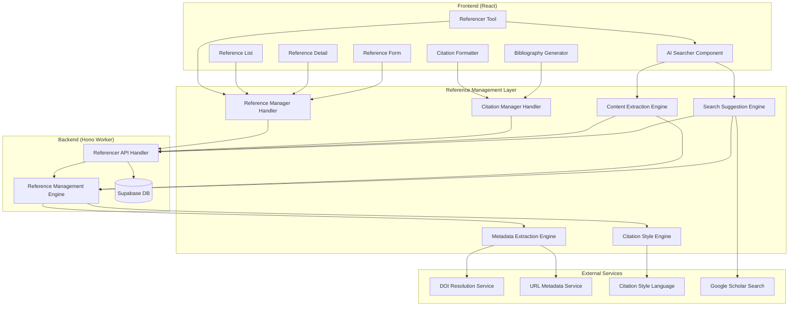

# Design Document

## Overview

The Referencer Tool is a comprehensive reference and citation management system that integrates seamlessly with the existing Thesis Copilot application. Following the established patterns from the Idealist and Proofreader tools, it provides a persistent reference library with intelligent citation insertion, automatic formatting, and bibliography generation. The tool operates as both a reference manager and citation assistant, allowing users to build and maintain their bibliography while writing their thesis proposals.

## Architecture

### High-Level Architecture



### Component Interaction Flow

1. **Reference Addition**: User adds reference via URL, DOI, or manual entry
2. **Metadata Extraction**: System extracts bibliographic metadata automatically
3. **Reference Storage**: Reference is stored in persistent library with conversation context
4. **Citation Insertion**: User selects text and inserts citation from reference library
5. **Style Application**: Citations are formatted according to selected academic style
6. **Bibliography Generation**: System generates formatted bibliography from all references
## Comp
onents and Interfaces

### Frontend Components

#### 1. Referencer Tool Component
- **Location**: `src/components/ui/referencer.tsx`
- **Responsibilities**:
  - Main interface for reference management
  - Coordinate reference operations and display
  - Manage overall referencer state
- **Interface**:
  ```typescript
  interface ReferencerProps {
    isOpen: boolean;
    onClose: () => void;
    currentConversation: { title: string; id: string };
  }
  
  interface ReferencerState {
    references: Reference[];
    selectedReference: Reference | null;
    citationStyle: CitationStyle;
    isLoading: boolean;
    searchQuery: string;
    filterType: ReferenceType | 'all';
    error: string | null;
  }
  ```

#### 2. Reference List Component
- **Location**: `src/components/ui/reference-list.tsx`
- **Responsibilities**:
  - Display list of saved references
  - Handle search and filtering
  - Provide reference selection for citations
- **Interface**:
  ```typescript
  interface ReferenceListProps {
    references: Reference[];
    onReferenceSelect: (reference: Reference) => void;
    onReferenceEdit: (reference: Reference) => void;
    onReferenceDelete: (referenceId: string) => void;
    searchQuery: string;
    onSearchChange: (query: string) => void;
    filterType: ReferenceType | 'all';
    onFilterChange: (type: ReferenceType | 'all') => void;
  }
  ```

#### 3. Reference Form Component
- **Location**: `src/components/ui/reference-form.tsx`
- **Responsibilities**:
  - Handle reference creation and editing
  - Support URL/DOI import and manual entry
  - Validate reference data
- **Interface**:
  ```typescript
  interface ReferenceFormProps {
    reference?: Reference;
    onSave: (reference: Reference) => void;
    onCancel: () => void;
    isLoading: boolean;
  }
  
  interface ReferenceFormState {
    formData: ReferenceFormData;
    importMode: 'url' | 'doi' | 'manual';
    validationErrors: ValidationError[];
    isExtracting: boolean;
  }
  ```

#### 4. Citation Formatter Component
- **Location**: `src/components/ui/citation-formatter.tsx`
- **Responsibilities**:
  - Format citations according to selected style
  - Handle inline citation insertion
  - Preview citation formatting
- **Interface**:
  ```typescript
  interface CitationFormatterProps {
    reference: Reference;
    citationStyle: CitationStyle;
    citationType: 'inline' | 'bibliography';
    onInsert: (citation: string) => void;
  }
  ```

#### 5. Bibliography Generator Component
- **Location**: `src/components/ui/bibliography-generator.tsx`
- **Responsibilities**:
  - Generate formatted bibliography
  - Export bibliography in various formats
  - Handle bibliography insertion
- **Interface**:
  ```typescript
  interface BibliographyGeneratorProps {
    references: Reference[];
    citationStyle: CitationStyle;
    onInsert: (bibliography: string) => void;
    onExport: (format: ExportFormat) => void;
  }
  ```### Ba
ckend Components

#### 1. Referencer API Handler
- **Location**: `src/worker/handlers/referencer-api.ts`
- **Responsibilities**:
  - Handle reference CRUD operations
  - Coordinate metadata extraction
  - Manage citation formatting requests
- **Endpoints**:
  ```typescript
  POST /api/referencer/references
  GET /api/referencer/references/:conversationId
  PUT /api/referencer/references/:referenceId
  DELETE /api/referencer/references/:referenceId
  POST /api/referencer/extract-metadata
  POST /api/referencer/format-citation
  POST /api/referencer/generate-bibliography
  ```

#### 2. Reference Management Engine
- **Location**: `src/worker/lib/reference-management-engine.ts`
- **Responsibilities**:
  - Process reference operations
  - Coordinate with metadata extraction
  - Handle reference validation
- **Interface**:
  ```typescript
  interface ReferenceManagementEngine {
    createReference(data: ReferenceFormData): Promise<Reference>;
    updateReference(id: string, data: ReferenceFormData): Promise<Reference>;
    deleteReference(id: string): Promise<void>;
    extractMetadata(source: string, type: 'url' | 'doi'): Promise<ReferenceMetadata>;
    validateReference(reference: Reference, style: CitationStyle): Promise<ValidationResult>;
  }
  ```

#### 3. Metadata Extraction Engine
- **Location**: `src/worker/lib/metadata-extraction-engine.ts`
- **Responsibilities**:
  - Extract metadata from URLs and DOIs
  - Parse bibliographic information
  - Handle extraction fallbacks
- **Interface**:
  ```typescript
  interface MetadataExtractionEngine {
    extractFromUrl(url: string): Promise<ReferenceMetadata>;
    extractFromDoi(doi: string): Promise<ReferenceMetadata>;
    parseHtmlMetadata(html: string): ReferenceMetadata;
    validateExtractedData(metadata: ReferenceMetadata): ValidationResult;
  }
  ```

#### 4. Citation Style Engine
- **Location**: `src/worker/lib/citation-style-engine.ts`
- **Responsibilities**:
  - Format citations according to academic styles
  - Generate bibliographies
  - Handle style-specific requirements
- **Interface**:
  ```typescript
  interface CitationStyleEngine {
    formatInlineCitation(reference: Reference, style: CitationStyle): string;
    formatBibliographyEntry(reference: Reference, style: CitationStyle): string;
    generateBibliography(references: Reference[], style: CitationStyle): string;
    validateStyleRequirements(reference: Reference, style: CitationStyle): ValidationResult;
  }
  ```## Data Mod
els

### Reference Models

```typescript
interface Reference {
  id: string;
  conversationId: string;
  type: ReferenceType;
  title: string;
  authors: Author[];
  publicationDate: Date;
  url?: string;
  doi?: string;
  journal?: string;
  volume?: string;
  issue?: string;
  pages?: string;
  publisher?: string;
  isbn?: string;
  edition?: string;
  chapter?: string;
  editor?: string;
  accessDate?: Date;
  notes?: string;
  tags: string[];
  createdAt: Date;
  updatedAt: Date;
}

enum ReferenceType {
  JOURNAL_ARTICLE = 'journal_article',
  BOOK = 'book',
  BOOK_CHAPTER = 'book_chapter',
  CONFERENCE_PAPER = 'conference_paper',
  THESIS = 'thesis',
  WEBSITE = 'website',
  REPORT = 'report',
  PATENT = 'patent',
  OTHER = 'other'
}

interface Author {
  firstName: string;
  lastName: string;
  middleName?: string;
  suffix?: string;
}

enum CitationStyle {
  APA = 'apa',
  MLA = 'mla',
  CHICAGO = 'chicago',
  HARVARD = 'harvard',
  IEEE = 'ieee',
  VANCOUVER = 'vancouver'
}
```

### Form and Validation Models

```typescript
interface ReferenceFormData {
  type: ReferenceType;
  title: string;
  authors: Author[];
  publicationDate: string;
  url?: string;
  doi?: string;
  journal?: string;
  volume?: string;
  issue?: string;
  pages?: string;
  publisher?: string;
  isbn?: string;
  edition?: string;
  chapter?: string;
  editor?: string;
  accessDate?: string;
  notes?: string;
  tags: string[];
}

interface ValidationError {
  field: string;
  message: string;
  severity: 'error' | 'warning';
}

interface ValidationResult {
  isValid: boolean;
  errors: ValidationError[];
  warnings: ValidationError[];
  missingFields: string[];
}
```### 
Metadata Extraction Models

```typescript
interface ReferenceMetadata {
  title?: string;
  authors?: Author[];
  publicationDate?: Date;
  journal?: string;
  volume?: string;
  issue?: string;
  pages?: string;
  publisher?: string;
  doi?: string;
  isbn?: string;
  url?: string;
  type?: ReferenceType;
  abstract?: string;
  keywords?: string[];
  confidence: number; // 0-1 scale for extraction confidence
}

interface MetadataExtractionRequest {
  source: string;
  type: 'url' | 'doi';
  conversationId: string;
}

interface MetadataExtractionResponse {
  success: boolean;
  metadata?: ReferenceMetadata;
  error?: string;
  extractionTime: number;
  source: string;
}
```

### Citation and Bibliography Models

```typescript
interface CitationRequest {
  referenceId: string;
  style: CitationStyle;
  type: 'inline' | 'bibliography';
  context?: string;
}

interface CitationResponse {
  success: boolean;
  citation?: string;
  error?: string;
  style: CitationStyle;
  type: 'inline' | 'bibliography';
}

interface BibliographyRequest {
  conversationId: string;
  style: CitationStyle;
  sortOrder: 'alphabetical' | 'chronological' | 'appearance';
  includeUrls: boolean;
}

interface BibliographyResponse {
  success: boolean;
  bibliography?: string;
  error?: string;
  referenceCount: number;
  style: CitationStyle;
}

enum ExportFormat {
  BIBTEX = 'bibtex',
  RIS = 'ris',
  ENDNOTE = 'endnote',
  ZOTERO = 'zotero',
  MENDELEY = 'mendeley'
}
```## Error H
andling

### Frontend Error Handling

1. **Metadata Extraction Errors**: Graceful fallback to manual entry with pre-filled data
2. **Citation Formatting Errors**: Display style-specific validation messages
3. **Reference Validation Errors**: Real-time validation with helpful suggestions
4. **Network Errors**: Offline mode with local storage fallback

### Backend Error Handling

1. **External Service Failures**: Implement retry logic for DOI/URL resolution
2. **Database Errors**: Proper error logging and user notification
3. **Metadata Parsing Errors**: Fallback to partial extraction
4. **Citation Style Errors**: Default to basic formatting with warnings

## Testing Strategy

### Unit Testing

1. **Reference Management**:
   - Test CRUD operations
   - Test validation logic
   - Test search and filtering

2. **Metadata Extraction**:
   - Test URL parsing
   - Test DOI resolution
   - Test fallback mechanisms

3. **Citation Formatting**:
   - Test style-specific formatting
   - Test bibliography generation
   - Test export functionality

### Integration Testing

1. **External Service Integration**:
   - Test DOI resolution services
   - Test URL metadata extraction
   - Test error handling

2. **Database Integration**:
   - Test reference persistence
   - Test conversation association
   - Test data integrity

3. **UI Integration**:
   - Test form validation
   - Test citation insertion
   - Test bibliography generation

### End-to-End Testing

1. **Complete Reference Workflow**:
   - Test reference addition via URL/DOI
   - Test citation insertion
   - Test bibliography generation

2. **Style Switching**:
   - Test citation reformatting
   - Test bibliography updates
   - Test validation changes##
 Database Schema

### Migration Strategy

The referencer functionality requires new database tables for reference storage and management:

#### Migration v4: Create Referencer Tables

```sql
-- Migration version: v4
-- Description: Create referencer tables for reference and citation management

-- Create reference type enum
CREATE TYPE reference_type AS ENUM (
  'journal_article',
  'book',
  'book_chapter',
  'conference_paper',
  'thesis',
  'website',
  'report',
  'patent',
  'other'
);

-- Create citation style enum
CREATE TYPE citation_style AS ENUM (
  'apa',
  'mla',
  'chicago',
  'harvard',
  'ieee',
  'vancouver'
);

-- Create references table
CREATE TABLE references (
  id UUID PRIMARY KEY DEFAULT gen_random_uuid(),
  conversation_id UUID NOT NULL REFERENCES chats(id) ON DELETE CASCADE,
  type reference_type NOT NULL,
  title TEXT NOT NULL,
  authors JSONB NOT NULL DEFAULT '[]',
  publication_date DATE,
  url TEXT,
  doi TEXT,
  journal TEXT,
  volume TEXT,
  issue TEXT,
  pages TEXT,
  publisher TEXT,
  isbn TEXT,
  edition TEXT,
  chapter TEXT,
  editor TEXT,
  access_date DATE,
  notes TEXT,
  tags TEXT[] DEFAULT '{}',
  metadata_confidence DECIMAL(3,2) DEFAULT 1.0,
  created_at TIMESTAMP WITH TIME ZONE DEFAULT NOW(),
  updated_at TIMESTAMP WITH TIME ZONE DEFAULT NOW()
);

-- Create citation instances table for tracking citations in documents
CREATE TABLE citation_instances (
  id UUID PRIMARY KEY DEFAULT gen_random_uuid(),
  reference_id UUID NOT NULL REFERENCES references(id) ON DELETE CASCADE,
  conversation_id UUID NOT NULL REFERENCES chats(id) ON DELETE CASCADE,
  citation_style citation_style NOT NULL,
  citation_text TEXT NOT NULL,
  document_position INTEGER,
  context TEXT,
  created_at TIMESTAMP WITH TIME ZONE DEFAULT NOW()
);

-- Create indexes for performance
CREATE INDEX idx_references_conversation_id ON references(conversation_id);
CREATE INDEX idx_references_type ON references(type);
CREATE INDEX idx_references_title ON references(title);
CREATE INDEX idx_references_authors ON references USING GIN(authors);
CREATE INDEX idx_references_tags ON references USING GIN(tags);
CREATE INDEX idx_references_doi ON references(doi) WHERE doi IS NOT NULL;
CREATE INDEX idx_references_created_at ON references(created_at);

CREATE INDEX idx_citation_instances_reference_id ON citation_instances(reference_id);
CREATE INDEX idx_citation_instances_conversation_id ON citation_instances(conversation_id);
CREATE INDEX idx_citation_instances_style ON citation_instances(citation_style);

-- Create trigger to update updated_at timestamp
CREATE TRIGGER update_references_updated_at 
    BEFORE UPDATE ON references 
    FOR EACH ROW EXECUTE FUNCTION update_updated_at_column();

-- Add constraints
ALTER TABLE references ADD CONSTRAINT check_doi_format 
    CHECK (doi IS NULL OR doi ~ '^10\.\d{4,}/.*');

ALTER TABLE references ADD CONSTRAINT check_url_format 
    CHECK (url IS NULL OR url ~ '^https?://.*');

ALTER TABLE references ADD CONSTRAINT check_confidence_range 
    CHECK (metadata_confidence >= 0.0 AND metadata_confidence <= 1.0);
```## Inte
gration Points

### Existing System Integration

1. **Builder Tool Integration**: Insert citations directly into thesis content
2. **Conversation Context**: Associate references with current conversation
3. **Database Integration**: Store references in existing Supabase database
4. **UI Component Reuse**: Use existing Sheet, Button, and form components

### External Service Integration

1. **DOI Resolution**: CrossRef API for DOI metadata
2. **URL Metadata**: Open Graph and Dublin Core metadata extraction
3. **Citation Styles**: Citation Style Language (CSL) for formatting
4. **Export Formats**: Standard bibliography export formats
5. **Google Scholar Search**: Academic paper search and metadata extraction

## Performance Considerations

### Frontend Performance

1. **Virtual Scrolling**: Handle large reference libraries efficiently
2. **Debounced Search**: Optimize search performance
3. **Lazy Loading**: Load reference details on demand
4. **Caching**: Cache formatted citations and bibliographies

### Backend Performance

1. **Metadata Extraction**: Optimize external API calls
2. **Citation Formatting**: Cache formatted citations
3. **Database Queries**: Optimize reference retrieval
4. **Batch Operations**: Process multiple references efficiently

## Security Considerations

### Input Validation

1. **URL Validation**: Sanitize and validate URLs before processing
2. **DOI Validation**: Verify DOI format and authenticity
3. **Reference Data**: Validate all reference fields
4. **Export Security**: Sanitize exported data

### API Security

1. **Rate Limiting**: Implement proper rate limiting for external APIs
2. **Authentication**: Ensure proper user authentication
3. **Data Validation**: Validate all incoming requests
4. **CORS Configuration**: Proper CORS setup for external services

## Deployment Considerations

### Environment Configuration

1. **External API Keys**: Configure DOI and metadata service credentials
2. **Feature Flags**: Implement feature flags for gradual rollout
3. **Performance Monitoring**: Monitor extraction and formatting performance

### Rollout Strategy

1. **Phased Rollout**: Gradual rollout of referencer features
2. **User Feedback**: Collect and incorporate user feedback
3. **Performance Monitoring**: Monitor system performance and adoption
