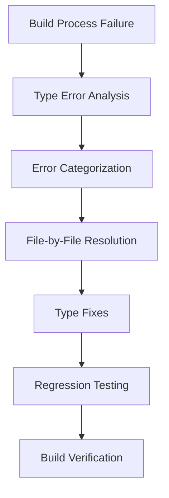

# Design Document

## Overview

This document outlines the design for fixing the remaining TypeScript type errors that currently prevent the Thesis Copilot application from building successfully. While the previous spec successfully resolved syntax errors, the application still fails to build due to numerous type-related errors. The design focuses on identifying and resolving type compatibility issues throughout the codebase to allow the application to build successfully.

## Architecture

### High-Level Approach



### Error Resolution Flow

1. **Error Identification**: Parse build output to identify specific files and type error categories
2. **Error Categorization**: Group errors by type and file location
3. **File Resolution**: Address errors in each affected file
4. **Fix Implementation**: Apply necessary type corrections
5. **Verification**: Confirm errors are resolved and no regressions are introduced

## Components and Interfaces

### Error Analysis Script

A script will be created to parse the TypeScript compilation errors and categorize them for efficient resolution:

```typescript
interface BuildError {
  file: string;
  line: number;
  column: number;
  errorCode: string;
  message: string;
}

interface ErrorSummary {
  files: string[];
  errorTypes: Record<string, number>;
  totalErrors: number;
}
```

### Resolution Process

Since these are type errors, we'll follow a systematic process:

1. **File Analysis**: Examine each file with errors to understand the type mismatches
2. **Error Investigation**: Look at the specific lines mentioned in the errors
3. **Type Correction**: Fix the type issues through:
   - Adding proper type annotations
   - Correcting interface implementations
   - Fixing function parameter types
   - Resolving property access issues
4. **Verification**: Run the build to confirm the errors are resolved

## Data Models

### Error Types

The current errors fall into several categories:

1. **TS17002: Expected corresponding JSX closing tag** - Missing or mismatched JSX closing tags
2. **TS2339: Property 'X' does not exist on type 'Y'** - Accessing properties that don't exist on an object type
3. **TS18046: 'X' is of type 'unknown'** - Using variables typed as 'unknown' without proper type checking
4. **TS2345: Argument of type 'X' is not assignable to parameter of type 'Y'** - Function parameter type mismatches
5. **TS2322: Type 'X' is not assignable to type 'Y'** - Variable assignment type mismatches
6. **TS2739: Type 'X' is missing the following properties from type 'Y'** - Interface implementation issues
7. **TS1005: ';' expected** - Syntax errors (possibly related to type issues)
8. **TS1109: Expression expected** - Syntax errors (possibly related to type issues)
9. **TS1128: Declaration or statement expected** - Syntax errors (possibly related to type issues)

## Error Handling

### Resolution Strategy

For each error type, we'll use the following resolution approaches:

1. **JSX closing tag errors (TS17002)**: Check for missing or mismatched JSX closing tags
2. **Property access errors (TS2339)**: Verify property names exist on objects or add proper type guards
3. **Unknown type errors (TS18046)**: Add proper type assertions or type guards
4. **Argument assignment errors (TS2345)**: Correct function parameter types or convert arguments
5. **Variable assignment errors (TS2322)**: Fix type mismatches in variable assignments
6. **Missing properties errors (TS2739)**: Implement missing properties or adjust interface expectations
7. **Syntax errors (TS1005, TS1109, TS1128)**: Fix syntax issues that may be caused by type errors

## Testing Strategy

### Verification Process

1. **Pre-fix verification**: Document the current errors by running `npm run build`
2. **Incremental testing**: After fixing errors in each file, run the build to confirm those errors are resolved
3. **Final verification**: Once all known errors are addressed, run a complete build to ensure no new errors were introduced

### Regression Testing

1. **Functional testing**: Manually test key application features to ensure they still work
2. **Existing test suite**: Run any existing automated tests to verify no regressions

## Implementation Plan

### Files to Address

Based on initial analysis, the most problematic files include:

1. **src/components/ui/concern-detail.tsx** (multiple JSX closing tag errors)
2. **src/lib/ai-searcher-performance-optimizer.ts** (property access errors)
3. **src/worker/handlers/ai-searcher-api.ts** (argument assignment errors)
4. **src/worker/handlers/proofreader-ai.ts** (multiple type errors)
5. **src/worker/lib/search-history-manager.ts** (type errors)
6. **src/worker/lib/reference-management-engine.ts** (type errors)

### Resolution Order

1. Start with concern-detail.tsx as it has multiple clear JSX errors
2. Move to ai-searcher-performance-optimizer.ts (property access errors)
3. Address ai-searcher-api.ts (argument assignment errors)
4. Continue with other files based on error count and complexity

### Detailed Steps

#### src/components/ui/concern-detail.tsx
- Errors: TS17002: Expected corresponding JSX closing tag (multiple instances)
- Likely cause: Missing or mismatched JSX closing tags
- Fix: Find the unclosed or mismatched JSX elements and properly close them

#### src/lib/ai-searcher-performance-optimizer.ts
- Errors: TS2339: Property 'lastAccessed' does not exist on type 'T'
- Likely cause: Generic type 'T' doesn't have the 'lastAccessed' property
- Fix: Add proper type constraints or type guards

#### src/worker/handlers/ai-searcher-api.ts
- Errors: TS2345: Argument not assignable to parameter
- Likely cause: Function parameter type mismatches
- Fix: Adjust argument types or function signatures to match

## Risk Mitigation

### Potential Issues

1. **Hidden dependencies**: Fixing one error might reveal others
2. **Cascading errors**: One type error might cause multiple error messages
3. **Complex type relationships**: Some errors may require significant refactoring

### Mitigation Strategies

1. **Incremental verification**: Test after each file fix to ensure we're making progress
2. **Thorough analysis**: Look at code context, not just the exact line mentioned
3. **Backup plan**: If errors persist, examine the surrounding code structure and type definitions

## Success Criteria

1. **Build Success**: `npm run build` completes without TypeScript compilation errors
2. **No Regressions**: Existing functionality remains intact
3. **Code Quality**: Fixes follow existing coding patterns and conventions
4. **Documentation**: Process and findings are documented for future reference