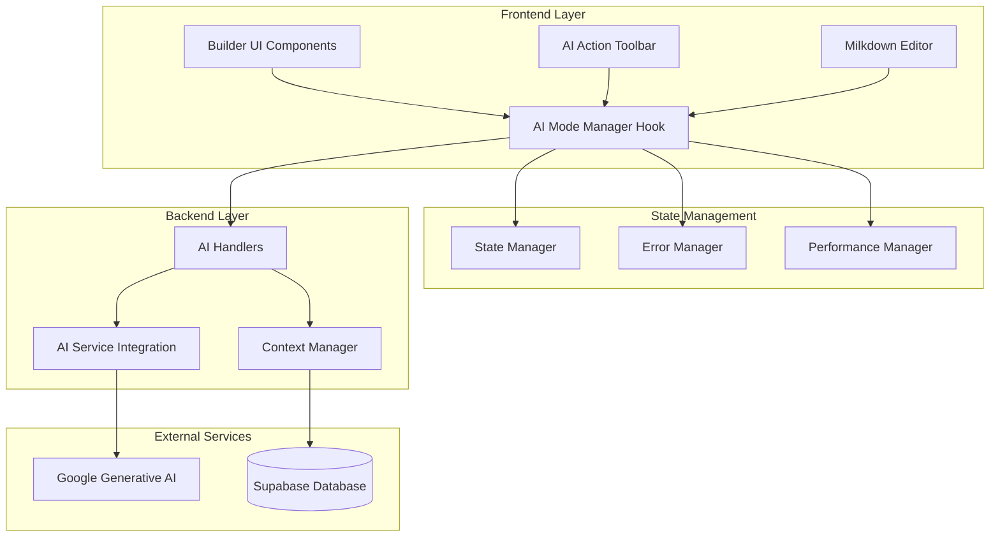

# AI Integration Developer Guide

## Overview

This guide provides comprehensive documentation for developers working with the AI integration features in the Builder tool. It covers architecture, implementation patterns, testing strategies, and best practices for extending and maintaining the AI functionality.

## Architecture Overview

### High-Level Architecture



### Component Hierarchy

```
Builder (Main Container)
├── AI Action Toolbar
│   ├── Mode Selection Buttons
│   ├── Status Indicators
│   └── Error Notifications
├── AI Input Components
│   ├── Prompt Input
│   ├── Modification Type Selector
│   └── Custom Prompt Input
├── AI Content Components
│   ├── Content Confirmation
│   ├── Content Preview
│   └── Modification Preview
└── Milkdown Editor
    ├── Selection Tracking
    ├── Cursor Management
    └── Content Insertion
```

## Core Components

### AI Mode Manager Hook

The `useAIModeManager` hook is the central state management system for all AI operations.

#### Key Responsibilities
- Mode state management
- AI request processing
- Error handling and recovery
- Performance optimization
- Content validation

#### Implementation Pattern

```typescript
// Hook usage pattern
const aiModeManager = useAIModeManager(
  conversationId,
  documentContent,
  {
    maxRetries: 3,
    timeout: 30000,
    enableCaching: true,
    enableOptimisticUpdates: true
  }
);

// State access
const {
  currentMode,
  isProcessing,
  errorState,
  hasSelectedText,
  selectedText
} = aiModeManager;

// Operations
await aiModeManager.processPrompt(prompt, cursorPosition);
await aiModeManager.processContinue(cursorPosition, selectedText);
await aiModeManager.processModify(selectedText, modificationType);
```

#### State Management Pattern

```typescript
interface AIModeManagerState {
  // Core state
  currentMode: AIMode;
  processingState: AIProcessingState;
  selectedText: TextSelection | null;
  errorState: ErrorState;
  
  // Modify mode specific
  showModificationTypeSelector: boolean;
  showModificationPreview: boolean;
  currentModificationType: ModificationType | null;
  modificationPreviewContent: string | null;
  
  // Performance optimization
  optimisticUpdate: OptimisticUpdate | null;
  performanceMetrics: PerformanceMetrics;
}
```

### AI Action Toolbar Component

The toolbar provides the main interface for AI mode selection and status display.

#### Component Structure

```typescript
interface AIActionToolbarProps {
  currentMode: AIMode;
  onModeChange: (mode: AIMode) => void;
  hasSelectedText: boolean;
  isAIProcessing: boolean;
  error?: AIError | null;
  canRetry?: boolean;
  retryCount?: number;
  onRetry?: () => void;
  onClearError?: () => void;
  onGracefulDegradation?: () => void;
}
```

#### Mode Configuration Pattern

```typescript
interface ModeConfig {
  mode: AIMode;
  label: string;
  description: string;
  icon: React.ComponentType<{ className?: string }>;
  shortcut?: string;
  requiresSelection?: boolean;
}

const modeConfigs: ModeConfig[] = [
  {
    mode: AIMode.PROMPT,
    label: "Prompt",
    description: "Generate content from a custom prompt",
    icon: MessageSquarePlus,
    shortcut: "Ctrl+P",
  },
  // ... other modes
];
```

### Backend AI Handlers

The backend handlers process AI requests and manage context.

#### Handler Structure

```typescript
// Handler function signature
export async function builderAIPromptHandler(c: Context): Promise<Response> {
  try {
    // 1. Validate request
    const request = await validateAIRequest(c);
    
    // 2. Build context
    const context = await contextManager.buildContext(
      request.documentContent,
      request.conversationId
    );
    
    // 3. Process AI request
    const response = await processAIRequest(request, context);
    
    // 4. Format and return response
    return c.json(formatAIResponse(response));
  } catch (error) {
    return handleAIError(c, error);
  }
}
```

#### Request/Response Types

```typescript
// Request types
interface AIPromptRequest {
  prompt: string;
  documentContent: string;
  cursorPosition: number;
  conversationId: string;
  timestamp: number;
}

interface AIContinueRequest {
  documentContent: string;
  cursorPosition: number;
  selectedText?: string;
  conversationId: string;
  timestamp: number;
}

interface AIModifyRequest {
  selectedText: string;
  modificationType: ModificationType;
  documentContent: string;
  conversationId: string;
  timestamp: number;
  customPrompt?: string;
}

// Response type
interface AIResponse {
  success: boolean;
  content?: string;
  error?: string;
  errorCode?: string;
  retryable?: boolean;
  metadata?: {
    tokensUsed: number;
    processingTime: number;
    requestId: string;
    timestamp: number;
  };
}
```

## Error Handling System

### Error Types and Classification

```typescript
enum AIErrorType {
  NETWORK_ERROR = 'NETWORK_ERROR',
  API_ERROR = 'API_ERROR',
  VALIDATION_ERROR = 'VALIDATION_ERROR',
  TIMEOUT_ERROR = 'TIMEOUT_ERROR',
  SERVICE_UNAVAILABLE = 'SERVICE_UNAVAILABLE',
  RATE_LIMIT_ERROR = 'RATE_LIMIT_ERROR',
  AUTHENTICATION_ERROR = 'AUTHENTICATION_ERROR',
  UNKNOWN_ERROR = 'UNKNOWN_ERROR',
  OPERATION_CANCELLED = 'OPERATION_CANCELLED'
}

class AIError extends Error {
  constructor(
    message: string,
    public type: AIErrorType,
    public code: string,
    public retryable: boolean = false,
    public originalError?: Error
  ) {
    super(message);
    this.name = 'AIError';
  }
}
```

### Error Recovery Strategies

```typescript
interface ErrorRecoveryStrategy {
  retryAttempts: number;
  retryDelay: number;
  exponentialBackoff: boolean;
  fallbackMode?: AIMode;
  userNotification: string;
}

class AIErrorHandler {
  static getRetryStrategy(error: AIError): ErrorRecoveryStrategy {
    switch (error.type) {
      case AIErrorType.NETWORK_ERROR:
        return {
          retryAttempts: 3,
          retryDelay: 1000,
          exponentialBackoff: true,
          userNotification: 'Network error. Retrying...'
        };
      
      case AIErrorType.SERVICE_UNAVAILABLE:
        return {
          retryAttempts: 2,
          retryDelay: 5000,
          exponentialBackoff: true,
          fallbackMode: AIMode.NONE,
          userNotification: 'AI service temporarily unavailable'
        };
      
      // ... other error types
    }
  }
}
```

### Error Handling Implementation

```typescript
// In AI Mode Manager Hook
const handleError = useCallback((error: unknown, context: ErrorContext) => {
  const aiError = error instanceof AIError ? error : new AIError(
    error instanceof Error ? error.message : String(error),
    AIErrorType.UNKNOWN_ERROR,
    'UNKNOWN',
    false,
    error instanceof Error ? error : undefined
  );
  
  const recoveryStrategy = AIErrorHandler.getRetryStrategy(aiError);
  
  setErrorState({
    hasError: true,
    error: aiError,
    recoveryStrategy,
    canRetry: recoveryStrategy.retryAttempts > 0,
    retryCount: context.retryCount || 0,
  });
  
  // Log error with context
  AIErrorHandler.handleError(aiError, context.operation, context);
  
  // Handle graceful degradation if enabled
  if (enableGracefulDegradation && AIErrorHandler.shouldGracefullyDegrade(aiError)) {
    const fallbackMode = AIErrorHandler.getFallbackMode(aiError, currentMode);
    if (fallbackMode !== currentMode) {
      setCurrentMode(fallbackMode);
    }
  }
}, [currentMode, enableGracefulDegradation]);
```

## Performance Optimization

### Caching System

```typescript
interface CacheEntry {
  key: string;
  response: AIResponse;
  timestamp: number;
  expiresAt: number;
  hitCount: number;
}

class AIPerformanceOptimizer {
  private cache = new Map<string, CacheEntry>();
  
  generateCacheKey(mode: AIMode, content: string, params: any): string {
    const hash = this.hashContent(content + JSON.stringify(params));
    return `${mode}-${hash}`;
  }
  
  getCachedResponse(key: string): AIResponse | null {
    const entry = this.cache.get(key);
    if (entry && entry.expiresAt > Date.now()) {
      entry.hitCount++;
      return entry.response;
    }
    return null;
  }
  
  setCachedResponse(key: string, response: AIResponse): void {
    this.cache.set(key, {
      key,
      response,
      timestamp: Date.now(),
      expiresAt: Date.now() + this.getCacheExpiry(),
      hitCount: 0
    });
  }
}
```

### Request Optimization

```typescript
// Debounced request processing
const debouncedProcessRequest = useMemo(
  () => debounce(async (requestFn: () => Promise<AIResponse>) => {
    return await requestFn();
  }, 300),
  []
);

// Optimistic updates
const createOptimisticUpdate = useCallback((mode: AIMode, params: any) => {
  return {
    id: generateId(),
    mode,
    params,
    timestamp: Date.now(),
    estimatedContent: generateEstimatedContent(mode, params)
  };
}, []);

// Context optimization
const optimizeDocumentContent = useCallback((content: string, mode: AIMode) => {
  switch (mode) {
    case AIMode.CONTINUE:
      return extractRelevantContext(content, cursorPosition, 1000);
    case AIMode.MODIFY:
      return extractSurroundingContext(content, selectedText, 500);
    default:
      return content.slice(0, 2000); // Limit context size
  }
}, [cursorPosition, selectedText]);
```

## Testing Strategies

### Unit Testing

```typescript
// Testing AI Mode Manager Hook
describe('useAIModeManager', () => {
  it('should handle mode transitions correctly', () => {
    const { result } = renderHook(() => 
      useAIModeManager('conv-123', 'test content')
    );
    
    act(() => {
      result.current.setMode(AIMode.PROMPT);
    });
    
    expect(result.current.currentMode).toBe(AIMode.PROMPT);
  });
  
  it('should process prompt requests', async () => {
    const { result } = renderHook(() => 
      useAIModeManager('conv-123', 'test content')
    );
    
    const mockResponse = { success: true, content: 'Generated content' };
    global.fetch = jest.fn().mockResolvedValue({
      ok: true,
      json: () => Promise.resolve(mockResponse)
    });
    
    await act(async () => {
      const response = await result.current.processPrompt('test prompt', 0);
      expect(response).toEqual(mockResponse);
    });
  });
});
```

### Integration Testing

```typescript
// Testing complete AI workflows
describe('AI Integration Workflows', () => {
  it('should complete prompt mode workflow', async () => {
    render(
      <Builder
        isOpen={true}
        onClose={jest.fn()}
        currentConversation={{ title: 'Test', id: 'conv-123' }}
      />
    );
    
    // Activate prompt mode
    fireEvent.click(screen.getByTestId('ai-mode-prompt'));
    
    // Enter prompt
    fireEvent.change(screen.getByPlaceholderText('Enter your prompt'), {
      target: { value: 'Test prompt' }
    });
    
    // Submit prompt
    fireEvent.click(screen.getByText('Generate'));
    
    // Wait for response
    await waitFor(() => {
      expect(screen.getByText('Generated content')).toBeInTheDocument();
    });
    
    // Accept content
    fireEvent.click(screen.getByText('Accept'));
    
    // Verify content insertion
    expect(screen.getByText('Generated content')).toBeInTheDocument();
  });
});
```

### End-to-End Testing

```typescript
// Testing complete user journeys
describe('Builder E2E Tests', () => {
  it('should handle complete AI workflow', async () => {
    // Setup test environment
    await page.goto('/builder');
    
    // Open builder
    await page.click('[data-testid="open-builder"]');
    
    // Use prompt mode
    await page.click('[data-testid="ai-mode-prompt"]');
    await page.fill('[placeholder="Enter your prompt"]', 'Write about AI');
    await page.click('text=Generate');
    
    // Wait for AI response
    await page.waitForSelector('[data-testid="ai-content-confirmation"]');
    
    // Accept content
    await page.click('text=Accept');
    
    // Verify content in editor
    const editorContent = await page.textContent('[data-testid="milkdown-editor"]');
    expect(editorContent).toContain('AI');
  });
});
```

## Best Practices

### Component Development

#### State Management
```typescript
// Use the AI Mode Manager hook for consistency
const aiModeManager = useAIModeManager(conversationId, documentContent);

// Access state through the hook interface
const { currentMode, isProcessing, errorState } = aiModeManager;

// Don't manage AI state separately in components
// ❌ Bad
const [aiMode, setAIMode] = useState(AIMode.NONE);

// ✅ Good
const { currentMode, setMode } = aiModeManager;
```

#### Error Handling
```typescript
// Always handle errors gracefully
try {
  const response = await aiModeManager.processPrompt(prompt, position);
  // Handle success
} catch (error) {
  // Error is already handled by the hook
  // Just provide user feedback if needed
  if (!aiModeManager.errorState.hasError) {
    toast.error('An unexpected error occurred');
  }
}
```

#### Performance
```typescript
// Use React.memo for expensive components
const AIActionToolbar = React.memo<AIActionToolbarProps>(({ 
  currentMode, 
  onModeChange, 
  // ... other props 
}) => {
  // Component implementation
});

// Memoize expensive calculations
const memoizedContextData = useMemo(() => {
  return processDocumentContext(documentContent);
}, [documentContent]);

// Debounce user input
const debouncedOnChange = useMemo(
  () => debounce(onChange, 300),
  [onChange]
);
```

### Backend Development

#### Request Validation
```typescript
// Always validate incoming requests
async function validateAIRequest(c: Context): Promise<AIPromptRequest> {
  const body = await c.req.json();
  
  // Validate required fields
  if (!body.conversationId) {
    throw new AIError(
      'ConversationId is required',
      AIErrorType.VALIDATION_ERROR,
      'MISSING_CONVERSATION_ID'
    );
  }
  
  if (!body.documentContent) {
    throw new AIError(
      'DocumentContent is required',
      AIErrorType.VALIDATION_ERROR,
      'MISSING_DOCUMENT_CONTENT'
    );
  }
  
  return body as AIPromptRequest;
}
```

#### Context Management
```typescript
// Build appropriate context for AI requests
class AIContextManager {
  async buildContext(documentContent: string, conversationId: string): Promise<string> {
    // Get conversation context
    const conversation = await this.getConversation(conversationId);
    
    // Get idea definitions
    const ideas = await this.getIdeaDefinitions(conversationId);
    
    // Format context for AI
    return this.formatContextForAI({
      documentContent,
      conversationTitle: conversation.title,
      ideaDefinitions: ideas,
      academicContext: this.extractAcademicContext(documentContent)
    });
  }
}
```

#### Response Formatting
```typescript
// Consistent response formatting
function formatAIResponse(
  content: string, 
  metadata: any, 
  requestId: string
): AIResponse {
  return {
    success: true,
    content,
    metadata: {
      tokensUsed: metadata.tokensUsed || 0,
      processingTime: metadata.processingTime || 0,
      requestId,
      timestamp: Date.now()
    }
  };
}
```

## Extending the AI System

### Adding New AI Modes

1. **Define the Mode**
```typescript
// Add to AIMode enum
enum AIMode {
  NONE = 'none',
  PROMPT = 'prompt',
  CONTINUE = 'continue',
  MODIFY = 'modify',
  TRANSLATE = 'translate', // New mode
}
```

2. **Update Mode Configuration**
```typescript
// Add to mode configs
const modeConfigs: ModeConfig[] = [
  // ... existing modes
  {
    mode: AIMode.TRANSLATE,
    label: "Translate",
    description: "Translate content to different languages",
    icon: Languages,
    shortcut: "Ctrl+T",
  }
];
```

3. **Implement Backend Handler**
```typescript
export async function builderAITranslateHandler(c: Context): Promise<Response> {
  try {
    const request = await validateTranslateRequest(c);
    const translatedContent = await translateContent(request);
    return c.json(formatAIResponse(translatedContent, {}, generateId()));
  } catch (error) {
    return handleAIError(c, error);
  }
}
```

4. **Update Frontend Hook**
```typescript
// Add to AI Mode Manager
const processTranslate = useCallback(async (
  text: string,
  targetLanguage: string
): Promise<AIResponse> => {
  return handleAIRequest(
    async () => {
      const response = await fetch('/api/builder/ai/translate', {
        method: 'POST',
        headers: { 'Content-Type': 'application/json' },
        body: JSON.stringify({ text, targetLanguage, conversationId })
      });
      return response.json();
    },
    AIMode.TRANSLATE,
    'Translating content...',
    'translate',
    { text, targetLanguage }
  );
}, [conversationId, handleAIRequest]);
```

### Adding New Modification Types

```typescript
// Extend ModificationType enum
enum ModificationType {
  REWRITE = 'rewrite',
  EXPAND = 'expand',
  SUMMARIZE = 'summarize',
  IMPROVE_CLARITY = 'improve_clarity',
  PROMPT = 'prompt',
  ACADEMIC_TONE = 'academic_tone', // New type
}

// Update modification type configs
const modificationTypeConfigs = [
  // ... existing types
  {
    type: ModificationType.ACADEMIC_TONE,
    label: 'Academic Tone',
    description: 'Convert to formal academic writing style',
    icon: GraduationCap
  }
];
```

## Deployment and Monitoring

### Environment Configuration

```typescript
// Environment variables for AI integration
interface AIConfig {
  GOOGLE_AI_API_KEY: string;
  AI_MODEL_NAME: string;
  AI_MAX_TOKENS: number;
  AI_TEMPERATURE: number;
  AI_CACHE_TTL: number;
  AI_RATE_LIMIT: number;
}

// Configuration validation
function validateAIConfig(): AIConfig {
  const config = {
    GOOGLE_AI_API_KEY: process.env.GOOGLE_AI_API_KEY,
    AI_MODEL_NAME: process.env.AI_MODEL_NAME || 'gemini-pro',
    AI_MAX_TOKENS: parseInt(process.env.AI_MAX_TOKENS || '1000'),
    AI_TEMPERATURE: parseFloat(process.env.AI_TEMPERATURE || '0.7'),
    AI_CACHE_TTL: parseInt(process.env.AI_CACHE_TTL || '3600'),
    AI_RATE_LIMIT: parseInt(process.env.AI_RATE_LIMIT || '100')
  };
  
  if (!config.GOOGLE_AI_API_KEY) {
    throw new Error('GOOGLE_AI_API_KEY is required');
  }
  
  return config as AIConfig;
}
```

### Performance Monitoring

```typescript
// Performance metrics collection
class AIPerformanceMonitor {
  private metrics: PerformanceMetrics = {
    totalRequests: 0,
    successfulRequests: 0,
    failedRequests: 0,
    averageResponseTime: 0,
    cacheHitRate: 0,
    tokenUsage: 0
  };
  
  recordRequest(duration: number, success: boolean, tokensUsed: number): void {
    this.metrics.totalRequests++;
    
    if (success) {
      this.metrics.successfulRequests++;
    } else {
      this.metrics.failedRequests++;
    }
    
    this.metrics.averageResponseTime = 
      (this.metrics.averageResponseTime + duration) / 2;
    
    this.metrics.tokenUsage += tokensUsed;
  }
  
  getMetrics(): PerformanceMetrics {
    return { ...this.metrics };
  }
}
```

### Error Monitoring

```typescript
// Error tracking and reporting
class AIErrorMonitor {
  static reportError(error: AIError, context: ErrorContext): void {
    // Log to console in development
    if (process.env.NODE_ENV === 'development') {
      console.error('AI Error:', {
        error: error.message,
        type: error.type,
        code: error.code,
        context,
        stack: error.stack
      });
    }
    
    // Report to monitoring service in production
    if (process.env.NODE_ENV === 'production') {
      // Send to error tracking service
      this.sendToErrorService(error, context);
    }
  }
  
  private static sendToErrorService(error: AIError, context: ErrorContext): void {
    // Implementation for error reporting service
    // e.g., Sentry, LogRocket, etc.
  }
}
```

## Security Considerations

### Input Sanitization

```typescript
// Sanitize user inputs before AI processing
function sanitizePrompt(prompt: string): string {
  // Remove potentially harmful content
  return prompt
    .replace(/<script\b[^<]*(?:(?!<\/script>)<[^<]*)*<\/script>/gi, '')
    .replace(/javascript:/gi, '')
    .replace(/on\w+\s*=/gi, '')
    .trim()
    .slice(0, 5000); // Limit length
}

// Validate content before processing
function validateContent(content: string): boolean {
  // Check for suspicious patterns
  const suspiciousPatterns = [
    /system\s*:/i,
    /ignore\s+previous\s+instructions/i,
    /act\s+as\s+if/i
  ];
  
  return !suspiciousPatterns.some(pattern => pattern.test(content));
}
```

### API Security

```typescript
// Rate limiting for AI endpoints
class AIRateLimiter {
  private requests = new Map<string, number[]>();
  
  isAllowed(userId: string, limit: number = 100, window: number = 3600000): boolean {
    const now = Date.now();
    const userRequests = this.requests.get(userId) || [];
    
    // Remove old requests outside the window
    const validRequests = userRequests.filter(time => now - time < window);
    
    if (validRequests.length >= limit) {
      return false;
    }
    
    validRequests.push(now);
    this.requests.set(userId, validRequests);
    return true;
  }
}
```

## Troubleshooting

### Common Development Issues

#### Hook Dependencies
```typescript
// ❌ Missing dependencies can cause stale closures
const processPrompt = useCallback(async (prompt: string) => {
  // Uses stale documentContent
  return await aiService.processPrompt(prompt, documentContent);
}, []); // Missing documentContent dependency

// ✅ Include all dependencies
const processPrompt = useCallback(async (prompt: string) => {
  return await aiService.processPrompt(prompt, documentContent);
}, [documentContent]);
```

#### State Updates
```typescript
// ❌ Direct state mutation
const updateMode = () => {
  processingState.isProcessing = true; // Don't mutate directly
};

// ✅ Use proper state setters
const updateMode = () => {
  setProcessingState(prev => ({
    ...prev,
    isProcessing: true
  }));
};
```

#### Error Handling
```typescript
// ❌ Swallowing errors
try {
  await processAIRequest();
} catch (error) {
  // Silent failure
}

// ✅ Proper error handling
try {
  await processAIRequest();
} catch (error) {
  handleError(error, { operation: 'processAIRequest', mode: currentMode });
  throw error; // Re-throw if needed
}
```

### Performance Issues

#### Memory Leaks
```typescript
// ❌ Not cleaning up subscriptions
useEffect(() => {
  const subscription = aiService.subscribe(handleUpdate);
  // Missing cleanup
}, []);

// ✅ Proper cleanup
useEffect(() => {
  const subscription = aiService.subscribe(handleUpdate);
  return () => subscription.unsubscribe();
}, []);
```

#### Excessive Re-renders
```typescript
// ❌ Creating new objects in render
const config = { maxRetries: 3, timeout: 30000 }; // New object every render

// ✅ Memoize or move outside component
const config = useMemo(() => ({ 
  maxRetries: 3, 
  timeout: 30000 
}), []);
```

## Contributing

### Code Style Guidelines

1. **TypeScript**: Use strict TypeScript with proper type definitions
2. **Error Handling**: Always handle errors gracefully with user feedback
3. **Performance**: Consider performance implications of all changes
4. **Testing**: Write comprehensive tests for new features
5. **Documentation**: Update documentation for API changes

### Pull Request Process

1. Create feature branch from main
2. Implement changes with tests
3. Update documentation
4. Run full test suite
5. Submit PR with detailed description
6. Address review feedback
7. Merge after approval

---

*This developer guide covers the AI integration architecture and implementation details. For user-facing documentation, see the AI Features User Guide.*